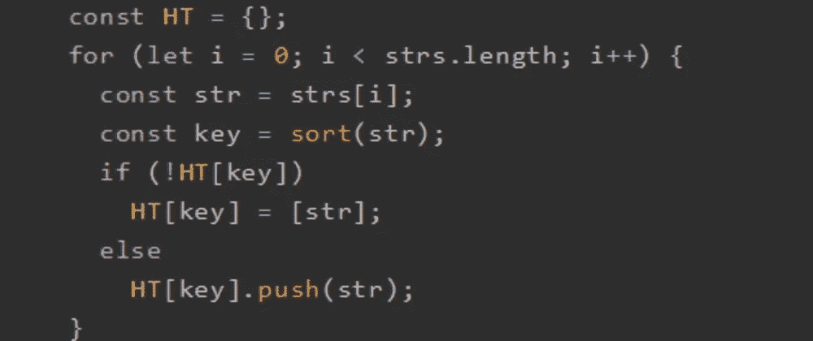
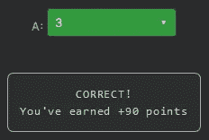

# 天才之路:高级#36

> 原文：<https://blog.devgenius.io/road-to-genius-advanced-36-f4459b77e61d?source=collection_archive---------32----------------------->



每天我都要解决几个 Codr 分级模式的编码挑战和难题。目标是达到天才的等级，在这个过程中我解释了我是如何解决这些问题的。你不需要任何编程背景就可以开始，而且你会学到很多新的有趣的东西。

```
function sort(str) {
  return str
    .split('')
    .sort()
    .join('');
}function anagrams(strs) {
  const HT = {};
  for (let i = 0; i < strs.length; i++) {
    const str = strs[i];
    const key = sort(str);
    if (!HT[key])
      HT[key] = [str];
    else
      HT[key].push(str);
  }
  return Object.values(HT);
}let arr = [
  '201',
  '021',
  '012',
  '120',
  '121',
  '010'
]let A = anagrams(arr);
A = A.length// A = ? (number)
```

这看起来是一个非常有趣的挑战，我很兴奋能解决它。挑战要求我们求解`A`的值，它是函数`anagrams`输出的长度，所以它的输出是一个数组，记住这一点:

```
return Object.values(HT);
```

让我们从函数`sort`开始说起。它接受一个字符串作为参数；它将字符串分割成单个字符作为数组；然后按升序对数组进行排序；最后，它将排序后的数组连接回一个字符串并返回它。这里有一些伪代码来说明这是如何工作的:

```
str = '201'str.split('') --> ['2', '0', '1']
   .sort()    --> ['0', '1', '2']
   .join('')  --> '012'
```

接下来是函数`anagrams`，它接受一个参数`strs`，这是一个字符串数组(下面声明为`arr`)。该函数从创建一个新的空对象`HT`开始；然后，它遍历数组中的每个字符串`str`。它创建一个`key`变量，其值作为函数的输出:

```
key = sort(str)
```

接下来 if 检查`HT`是否没有键条目`key`，如果有，它设置一个新的键值条目，其中值是一个以`str`为唯一值的数组。但是如果它已经有了密钥，它就把`str`推到数组中。

由于函数`sort`，基本上所有来自`arr`的包含 0、1 和 2 的值都将变成`012`；这是前四根弦。第五个字符串`121`将导致`112`，最后一个字符串`010`变成`001`。有了这些信息，我们就可以弄清楚`HT`物体看起来会是什么样子:

```
HT = {
  '012': [...],   // length: 4
  '112': [...],   // length: 1
  '001': [...],   // length: 1
}
```

最后函数返回`Object.values(HT)`。这基本上是把`HT`的所有值作为一个数组，并返回；返回值将如下所示:

```
[[...],  [...],  [...]]
```

所以它只是一个包含三个数组的数组。现在最后是`A = output.length`，也就是 3:



通过解决这些挑战，你可以训练自己成为一名更好的程序员。您将学到更新更好的分析、调试和改进代码的方法。因此，你在商业上会更有效率和价值。今天就在[https://nevolin.be/codr/](https://nevolin.be/codr/)开始行动并成为认证 Codr