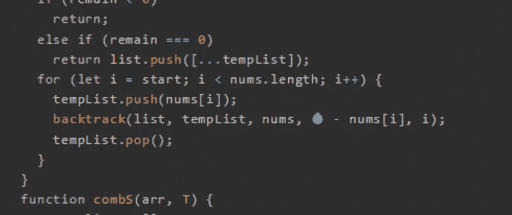
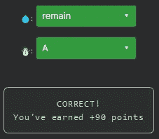

# 天才之路:进阶#37

> 原文：<https://blog.devgenius.io/road-to-genius-advanced-37-72a7d1d2a1ad?source=collection_archive---------31----------------------->



每天我都要解决几个 Codr 分级模式的编码挑战和难题。目标是达到天才的等级，在这个过程中我解释了我是如何解决这些问题的。你不需要任何编程背景就可以开始，而且你会学到很多新的有趣的东西。

```
function backtrack(list, tempList, nums, remain, start) {
  if (remain < 0)
    return;
  else if (remain === 0)
    return list.push([...tempList]);
  for (let i = start; i < nums.length; i++) {
    tempList.push(nums[i]);
    backtrack(list, tempList, nums, 💧 - nums[i], i);
    tempList.pop();
  }
}
function combS(arr, T) {
  const list = [];
  backtrack(list, [], arr.sort((a, b) => a - b), T, 0);
  return list;
}
let A = combS([2, 3, 4], 4);
☃️ = A.length;// 💧 = ? (identifier)
// ☃️ = ? (identifier)
// such that A = 2 (number)
```

这段代码看起来很有挑战性，因为它与回溯相关；幸运的是，我们只需要修复两个错误。最后一个 bug ☃️是花生，应该是`A`因为要满足挑战要求(`A = 2 = A.length`)。

找出另一个错误💧我们必须仔细分析代码。函数`backtrack`是递归的，它会一直调用自己，直到满足某个条件，就像这样:

```
function backtrack(arg) {
  if (arg == x)
    return;
  else
    backtrack(arg+1)
}
```

乍一看，我们不知道`backtrack`是做什么的，但是我们可以通过分析变量名做出有根据的猜测。我们看到了变量`remain`，这让我想起了除法运算(~余数)。

else-if-语句检查是否是`remain == 0`，如果是，它将一些项目推入`list`。然后，for 循环从`nums`开始遍历每个数字，并调用回溯函数，如下所示:

```
for (...) {
   backtrack(..., 💧 - nums[i], ...)
}
```

直到现在我还没见过任何除法相关的运算，除了这个减法。在数学中，我们可以用减法来计算结果和余数，下面是一个例子:

```
9/2 = ?
D = 9
V = 2O = 9-2 = 7
O = 7-2 = 5
O = 5-2 = 3
O = 3-2 = 1
O = 1-2 = -1  -->  0 reached
R = |O| = 1There are 4 subtract operations that are >= 0:
9/2 = 4 and 1 as remainder
```

`backtrack`函数似乎就是这样做的，但是是以递归的方式。它获取当前的`remain`并减去某个数字，然后下一个递归检查结果是否为零。所以我的最佳选择是💧应该是`remain`。

但是我们想 100%确定这一点，所以让我们接受挑战的输入，并快速计算我们是否得到伪代码中的`A=2`:

```
backtrack(remain = 4)-- backtrack(remain = 4-2 = 2)
---- backtrack(remain = 2-2 = 0) --> push
---- backtrack(remain = 2-3 = -1)
---- backtrack(remain = 2-4 = -2)-- backtrack(remain = 4-3 = 1)
---- backtrack(remain = 1-3 = -2)
---- backtrack(remain = 1-4 = -3)-- backtrack(remain = 4-4 = 0)  --> push
```

如你所见，我们有 2 个推送操作，这两个操作都将 2 个数组推送到`combS`内的`list`数组中。所以最终`A = list.length = 2`。



通过解决这些挑战，你可以训练自己成为一名更好的程序员。您将学到更新更好的分析、调试和改进代码的方法。因此，你在商业上会更有效率和价值。今天就在[https://nevolin.be/codr/](https://nevolin.be/codr/)开始行动，成为一名认证 Codr