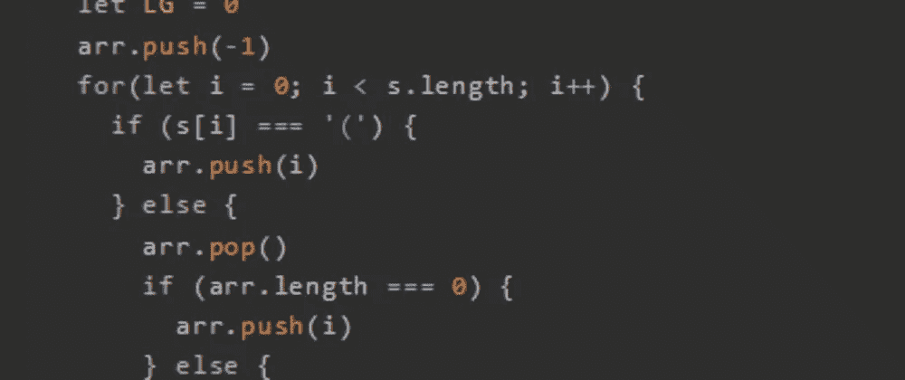
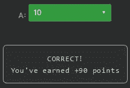

# 天才之路:高级#38

> 原文：<https://blog.devgenius.io/road-to-genius-advanced-38-7a854107d933?source=collection_archive---------29----------------------->



每天我都要解决几个 Codr 分级模式的编码挑战和难题。目标是达到天才的等级，在这个过程中我解释了我是如何解决这些问题的。你不需要任何编程背景就可以开始，而且你会学到很多新的有趣的东西。

```
function LVP(s) {
  let arr = new Array()
  let LG = 0
  arr.push(-1)
  for(let i = 0; i < s.length; i++) {
    if (s[i] === '(') {
      arr.push(i)
    } else {
      arr.pop()
      if (arr.length === 0) {
        arr.push(i)
      } else {
        LG = Math.max(LG, i - arr[arr.length-1])
      }
    }
  }
  return LG
}let A = LVP('(((())(())()');// A = ? (number)
```

我们在很多集之前就遇到过这种代码(剧透！这里:【https://dev.to/codr/road-to-genius-smart-25-144l】)但是这一次我们要全面地分析它来解决它。我已经知道答案了，因为我知道代码是做什么的，不过还是让我们来看看吧。

我们必须计算出`A`的值(数字),它是以下各项的输出:

```
A = LVP('(((())(())()')
```

快速浏览代码后，它与括号有关，很可能是语法验证。这个函数中最需要跟踪的对象是`arr`，因为一切似乎都依赖于它。

为了理解代码实际做什么，让我们跟踪伪代码中的`arr`:

```
s = '(((())(())()'
LG = 0
arr = [-1]for each "i" in "s":i0 == (
arr = [-1, 0] --> pushi1 == (
arr = [-1, 0, 1] --> pushi2 == (
arr = [-1, 0, 1, 2] --> pushi3 == )
arr = [-1, 0, 1] --> pop
LG = max(0, 3-1) = 2i4 == )
arr = [-1, 0] --> pop
LG = max(2, 4-0) = 4i5 == (
arr = [-1, 0, 5] --> pushi6 == (
arr = [-1, 0, 5, 6] --> pushi7 == )
arr = [-1, 0, 5] --> pop
LG = max(4, 7-5) = 4i8 == )
arr = [-1, 0] --> pop
LG = max(4, 8-0) = 8i9 == (
arr = [-1, 0, 9] --> pushi10 == )
arr = [-1, 0] --> pop
LG = max(8, 10-0) = 10return LG=10--> A = 10
```

就这样我们发现了`A=10`:



通过解决这些挑战，你可以训练自己成为一名更好的程序员。您将学到更新更好的分析、调试和改进代码的方法。因此，你在商业上会更有效率和价值。今天就在[https://nevolin.be/codr/](https://nevolin.be/codr/)开始行动，成为一名认证 Codr