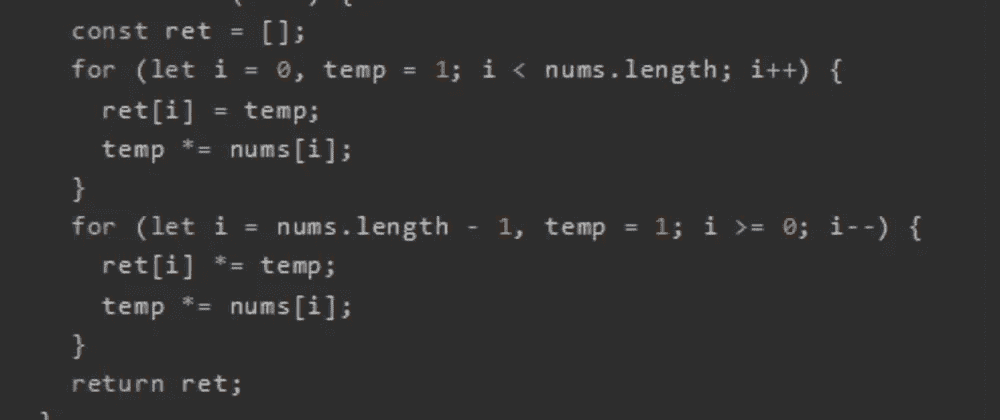
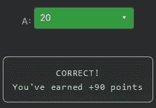

# 天才之路:高级#39

> 原文：<https://blog.devgenius.io/road-to-genius-advanced-39-464dac847906?source=collection_archive---------23----------------------->



每天我都要解决几个 Codr 分级模式的编码挑战和难题。目标是达到天才的等级，在这个过程中我解释了我是如何解决这些问题的。你不需要任何编程背景就可以开始，而且你会学到很多新的有趣的东西。

```
function PES(nums) {
  const ret = [];
  for (let i = 0, temp = 1; i < nums.length; i++) {
    ret[i] = temp;
    temp *= nums[i];
  }
  for (let i = nums.length - 1, temp = 1; i >= 0; i--) {
    ret[i] *= temp;
    temp *= nums[i];
  }
  return ret;
}let A = PES([1, 4, 5]);
A = A[0]// A = ? (number)
```

在今天的挑战中，我们需要计算出`A[0]`的值，其中`A`是函数`PES([1,4,5])`的数组和输出。

乍一看，我不知道`PES`是做什么的，除了它包含两个 for 循环和几个乘法；看起来是一些基础数学，应该不会太难。

解决这个问题的最快方法是暴力破解，我们只有 3 个输入数字，所以让我们用伪代码来实现:

```
--- first for-loop (forwards)
ret = []
temp = 1 ret = [1]
  temp = 1*1 = 1 ret = [1, 1]
  temp = 1*4 = 4 ret = [1, 1, 4]
  temp = ... // I don't care--- second for-loop (backwards)
ret = [1, 1, 4]
temp = 1 ret = [1, 1, 4*1]
  temp = 1*5 = 5 ret = [1, 1*5, 4]
  temp = 5*4 = 20 ret = [1*20, 5, 4]
  temp = ... // I don't care return ret=[20, 5, 4] = A
```

我们发现`A[0] == 20`。



通过解决这些挑战，你可以训练自己成为一名更好的程序员。您将学到更新更好的分析、调试和改进代码的方法。因此，你在商业上会更有效率和价值。今天就在[https://nevolin.be/codr/](https://nevolin.be/codr/)开始行动并成为认证 Codr