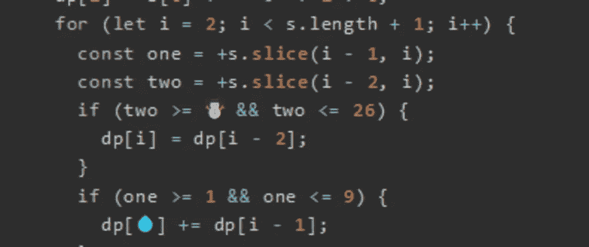
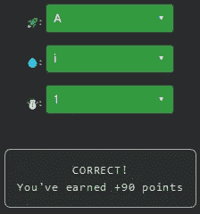

# 天才之路:高级#40

> 原文：<https://blog.devgenius.io/road-to-genius-advanced-40-6584834b90f2?source=collection_archive---------16----------------------->



每天我都要解决几个 Codr 分级模式的编码挑战和难题。目标是达到天才的等级，在这个过程中我解释了我是如何解决这些问题的。你不需要任何编程背景就可以开始，而且你会学到很多新的有趣的东西。

```
function numDecodings(s) {
  if (s == null || s.length == 0) {
    return 0;
  }
  const dp = Array(s.length + 1).fill(0);
  dp[0] = 1;
  dp[1] = s[0] !== '0' ? 1 : 0;
  for (let i = 2; i < s.length + 1; i++) {
    const one = +s.slice(i - 1, i);
    const two = +s.slice(i - 2, i);
    if (two >= ☃️ && two <= 26) {
      dp[i] = dp[i - 2];
    }
    if (one >= 1 && one <= 9) {
      dp[💧] += dp[i - 1];
    }
  }
  return dp[dp.length - 1];
}
let 🚀 = numDecodings('6749');// 🚀 = ? (identifier)
// 💧 = ? (identifier)
// ☃️ = ? (number)
// such that A = 1 (number)
```

在今天的挑战中，我对代码的作用一无所知，只知道它与解码数字有关(函数名揭示了这一点)。我希望我们不用完全分析代码就能解决这个问题，所以让我们看看。

第一个 bug🚀很容易修复，应该是`A`。

剩下的两个 bug 看起来很接近，为了修复它们，我们必须查看代码的一部分:

```
if (two >= ☃️ && two <= 26) {
  dp[i] = dp[i - 2];
}
if (one >= 1 && one <= 9) {
  dp[💧] += dp[i - 1];
}
```

我对 bug 最好的赌注💧就是`i`，因为上面两行我们看到了非常相似的代码。

最后，注意两个 if 条件看起来非常相似，它们都有一个下限和一个上限。我对☃️的押注是 1，以确保它匹配第二个 if 条件的结构。

现在我们可以交叉手指，点击验证:



既然是周日，就不打扰你写详细的代码分析了，就放在这里吧:)

通过解决这些挑战，你可以训练自己成为一名更好的程序员。您将学到更新更好的分析、调试和改进代码的方法。因此，你在商业上会更有效率和价值。今天就在 https://nevolin.be/codr/的[开始行动，成为一名认证 Codr](https://nevolin.be/codr/)