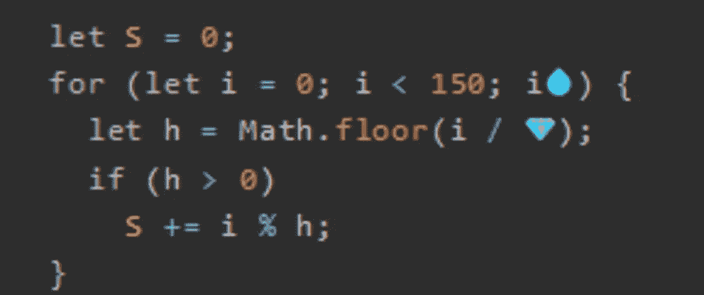
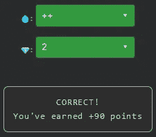

# 天才之路:高级#41

> 原文：<https://blog.devgenius.io/road-to-genius-advanced-41-b759dd276322?source=collection_archive---------24----------------------->



每天我都要解决几个 Codr 分级模式的编码挑战和难题。目标是达到天才的等级，在这个过程中我解释了我是如何解决这些问题的。你不需要任何编程背景就可以开始，而且你会学到很多新的有趣的东西。

```
let S = 0;
for (let i = 0; i < 150; i💧) {
  let h = Math.floor(i / 💎);
  if (h > 0)
    S += i % h;
}// 💧 = ? (operator)
// 💎 = ? (number)
// such that S = 73 (number)
```

这是一个高级挑战的非常短的代码，让我们来看看。代码的核心是一个从 0 到 150(不包括)的 for 循环，然后根据 if 条件增加`S`的值。

我们不必完全分析代码，因为修复两个必需的 bug 相当简单。

第一个💧必须是`++`操作符，以确保 for 循环正确工作。

第二个 bug💎是相当棘手的，你不能确定它的值在一个简单的方法，它可能是任何数字。要么你对代码进行逆向工程以确保`S = 73`在最后，要么偷看一下可能的答案💎:0、2 和 150。用 0 或 150 除`i`永远不会得到大于 0 的值，所以 if 条件永远不会被触发。剩下的唯一选择是 2:



通过解决这些挑战，你可以训练自己成为一名更好的程序员。您将学到更新更好的分析、调试和改进代码的方法。因此，你在商业上会更有效率和价值。今天就在 https://nevolin.be/codr/的[开始行动，成为一名认证 Codr](https://nevolin.be/codr/)