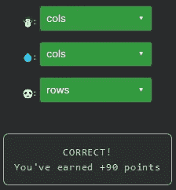

# 天才之路:高级#42

> 原文：<https://blog.devgenius.io/road-to-genius-advanced-42-6bd36b4f8c8c?source=collection_archive---------22----------------------->

每天我都要解决几个 Codr 分级模式的编码挑战和难题。目标是达到天才的等级，在这个过程中我解释了我是如何解决这些问题的。你不需要任何编程背景就可以开始，而且你会学到很多新的有趣的东西。

```
function DFS(board, row, col, rows, cols, word, cur) {
  if (row >= rows || row < 0)
    return false;
  if (col >= cols || col < 0)
    return false;
  const item = board[row][col];
  if (item !== word[cur])
    return false;
  if (cur + 1 === word.length)
    return true;
  board[row][col] = null;
  const res = DFS(board, row + 1, col, rows, 💧, word, cur + 1) || DFS(board, row - 1, col, rows, cols, word, cur + 1) || DFS(board, row, col - 1, rows, cols, word, cur + 1) || DFS(board, row, col + 1, rows, ☃️, word, cur + 1);
  board[row][col] = item;
  return res;
}
function exist(board, word) {
  if (word.length === 0)
    return true;
  if (board.length === 0)
    return false;
  const rows = board.length;
  const cols = board[0].length;
  for (let i = 0; i < rows; i++) {
    for (let j = 0; j < cols; j++) {
      const hit = DFS(board, i, j, 🐼, cols, word, 0);
      if (hit)
        return true;
    }
  }
  return false;
}
let board = [['3', '6', '7', '7'], ['1', '2', '9', '5'], ['8', '2', '3', '7'], ['1', '7', '7', '3']];
let A = exist(board, '84');// ☃️ = ? (identifier)
// 💧 = ? (identifier)
// 🐼 = ? (identifier)
// such that A = false (boolean)
```

在今天的挑战中，我们被给予了相当多的代码，但我不知道它是做什么的。幸运的是，我们只需要修复 3 个 bug，所以让我们开始吧。

前两个错误出现在同一行:

```
const res = DFS(board, row + 1, col, rows, 💧, word, cur + 1)
         || DFS(board, row - 1, col, rows, cols, word, cur + 1)
         || DFS(board, row, col - 1, rows, cols, word, cur + 1)
         || DFS(board, row, col + 1, rows, ☃️, word, cur + 1);
```

两个 bug💧和☃️很有可能是,`cols`,因为这两条线在相同的论点位置也使用了,`cols`。

最后的 bug🐼在线上:

```
const hit = DFS(board, i, j, 🐼, cols, word, 0);
```

既然这样🐼很可能会是`rows`。在整个代码中，对`DFS`的函数调用似乎没有改变`rows`和`cols`的参数。让我们测试一下这个假设:



太好了！由于有相当多的代码我不知道它在做什么，我将跳过详细的分析；我们很可能会在更高的级别上再次遇到这种代码。

通过解决这些挑战，你可以训练自己成为一名更好的程序员。您将学到更新更好的分析、调试和改进代码的方法。因此，你在商业上会更有效率和价值。今天就在[https://nevolin.be/codr/](https://nevolin.be/codr/)开始行动，成为一名认证 Codr