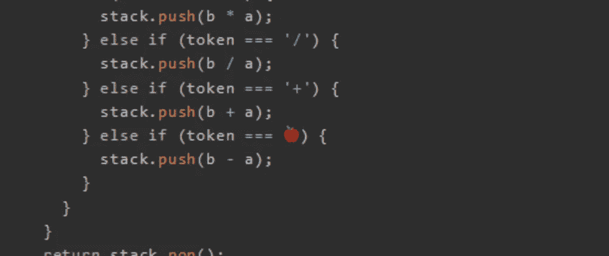

# 天才之路:进阶#43

> 原文：<https://blog.devgenius.io/road-to-genius-advanced-43-1565e8aea57?source=collection_archive---------17----------------------->



每天我都要解决几个 Codr 分级模式的编码挑战和难题。目标是达到天才的等级，在这个过程中我解释了我是如何解决这些问题的。你不需要任何编程背景就可以开始，而且你会学到很多新的有趣的东西。

```
function RPN(tokens) {
  const stack = [];
  for (let index = 0; index < tokens.length; index++) {
    const token = tokens[index];
    if (!Number.isNaN(Number(token))) {
      stack.push(token);
    } else {
      const a = Number(stack.pop());
      const b = Number(stack.pop());
      if (token === '*') {
        stack.push(b * a);
      } else if (token === '/') {
        stack.push(b / a);
      } else if (token === '+') {
        stack.push(b + a);
      } else if (token === 🍎) {
        stack.push(b - a);
      }
    }
  }
  return stack.pop();
}
let arr = ['5', '4', '1', '2', '+', '7', '*', '/', '*', '2', '+', '4', '+'];
let A = RPN(arr);
A = Math.floor(A);// 🍎 = ? (string)
// such that A = 6 (number)
```

这是一个有趣的挑战，我们只需要修复一个 bug🍎。这是一个简单的挑战。要解决这个问题，我们必须看看 bug 周围的环境:

```
if (token === '*') {
  stack.push(b * a);
} else if (token === '/') {
  stack.push(b / a);
} else if (token === '+') {
  stack.push(b + a);
} else if (token === 🍎) {
  stack.push(b - a);
}
```

请注意，令牌是表示操作的某个字符串(*、/、+和🍎)，它下面的推送操作揭示了它的实际操作，所以🍎必须是`-`。


关于这段代码的更多信息；函数`RPN`代表逆向波兰符号，这是一种表示一系列要计算的数学运算的方式。你可以谷歌一下了解更多的细节，因为我们以后可能会再次遇到它，我就说到这里。

通过解决这些挑战，你可以训练自己成为一名更好的程序员。您将学到更新更好的分析、调试和改进代码的方法。因此，你在商业上会更有效率和价值。今天就在 https://nevolin.be/codr/的[开始行动，成为一名认证的 Codr](https://nevolin.be/codr/)