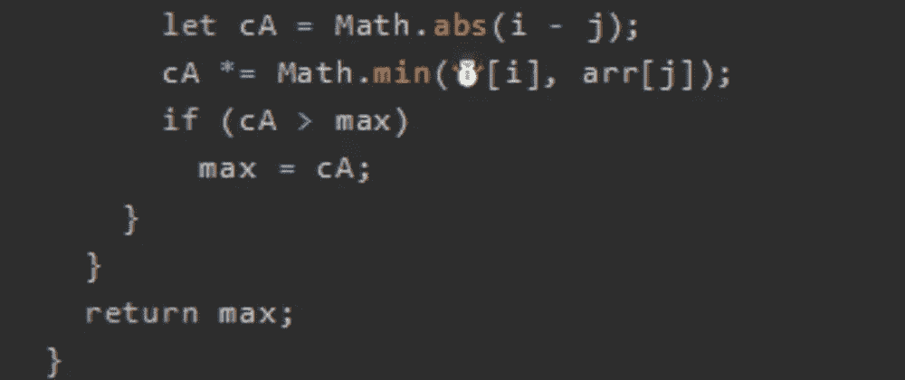
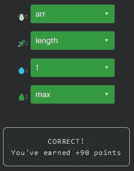

# 天才之路:高级#44

> 原文：<https://blog.devgenius.io/road-to-genius-advanced-44-fbdaf0a2ef26?source=collection_archive---------23----------------------->



每天我都要解决几个 Codr 分级模式的编码挑战和难题。目标是达到天才的等级，在这个过程中我解释了我是如何解决这些问题的。你不需要任何编程背景就可以开始，而且你会学到很多新的有趣的东西。

```
function maxa(arr) {
  let 💰 = 0;
  for (let i = 0; i < arr.length; i++) {
    for (let j = i + 1; j < arr.🚀; j++) {
      let cA = Math.abs(i - j);
      cA *= Math.min(☃️[i], arr[j]);
      if (cA > max)
        max = cA;
    }
  }
  return max;
}
let A = maxa([5, 💧, 3, 7, 1, 4]);// ☃️ = ? (identifier)
// 🚀 = ? (identifier)
// 💧 = ? (number)
// 💰 = ? (identifier)
// such that A = 20 (number)
```

今天的挑战相对简单，但确实需要一些脑力。

第一个 bug💰是一个变量声明，在快速浏览所有行之后，唯一被使用但还没有被声明的变量是`max`。

第二个 bug🚀很可能是数组的属性`length`。

第三个 bug ☃️是一个变量，它被用在一个数组中，就像它的邻居一样，所以我的最佳选择是它应该是`arr`。

最后的 bug💧应该是一个数字，它是函数`maxa`输入的一部分；我们必须确保`A = 20`完成挑战。为了确定这个数字，我们必须分析这个函数的作用。

函数`maxa`开始于所有数字的从`i = 0`开始的 for 循环，然后是从`j = i+1`开始的第二个 for 循环。变量`cA`决定`i`和`j`之间的距离，然后乘以`i`和`j`处的最小值；最后，`cA`的最大记录值存储在(并返回)`max`中。

目标是找到`i`和`j`使得`max = 20`。让我们用伪代码来帮助我们:

```
max = cA * min(arr_i, arr_j)factors of 20 are:
1 * 20
2 * 10
4 * 5-----let Y = abs(i - j),        Y must be either 4 or 5
let Z = min(arr_i, arr_j), Z must be either 5 or 4
then cA = Y * Z = 20-----the largest value for Y is abs(0 - 5) = 5
then Z = min(5, 4) = 4
then cA = 5 * 4 = 20  --> requirement met
```

因为…的位置💧在数组中既不是 0 也不是 5，只要它不会导致大于 20 的`cA`值，它的值就无关紧要。所以我们可以选择最小值，比如 1:



通过解决这些挑战，你可以训练自己成为一名更好的程序员。您将学到更新更好的分析、调试和改进代码的方法。因此，你在商业上会更有效率和价值。今天就在[https://nevolin.be/codr/](https://nevolin.be/codr/)开始行动，成为一名认证 Codr