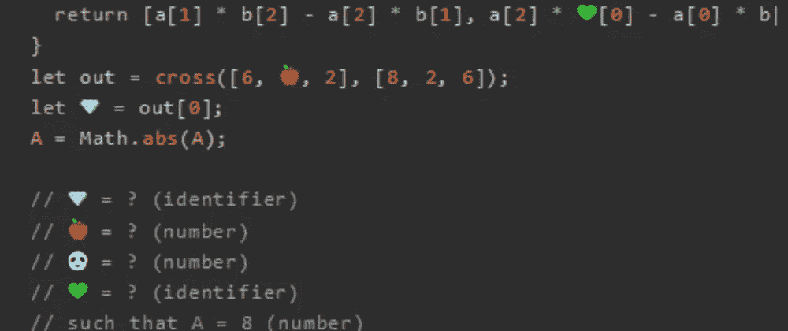
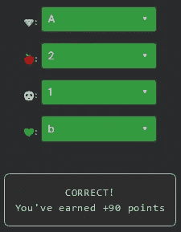

# 天才之路:高级#45

> 原文：<https://blog.devgenius.io/road-to-genius-advanced-45-dc9f564586e4?source=collection_archive---------16----------------------->



每天我都要解决几个 Codr 分级模式的编码挑战和难题。目标是达到天才的等级，在这个过程中我解释了我是如何解决这些问题的。你不需要任何编程背景就可以开始，而且你会学到很多新的有趣的东西。

```
function cross(a, b) {
  return [a[1] * b[2] - a[2] * b[1], a[2] * 💚[0] - a[0] * b[2], a[0] * b[🐼] - a[1] * b[0]];
}
let out = cross([6, 🍎, 2], [8, 2, 6]);
let 💎 = out[0];
A = Math.abs(A);// 💎 = ? (identifier)
// 🍎 = ? (number)
// 🐼 = ? (number)
// 💚 = ? (identifier)
// such that A = 8 (number)
```

今天的挑战是，等等……我们之前在第 31 集里遇到过类似的代码([https://dev.to/codr/road-to-genius-advanced-31-7hh](https://dev.to/codr/road-to-genius-advanced-31-7hh))。这又是一个`cross`生产函数，但这次要修复不同的错误。

我们已经学过这个函数的对称性，所以我们知道💚是`b`和🐼是 1。病菌💎应该是`A`。

我们只剩下虫子了🍎我们必须弄清楚。

我们知道`A = out[0]`，输出的第一个元素由以下公式定义:

```
a[1] * b[2] - a[2] * b[1]
```

如果我们用得到的数字代替这些:

```
🍎 * 6 - 2 * 2
```

挑战表明`A = 8`我们必须解决🍎：

```
🍎 * 6 - 2 * 2 = 8
🍎 = (8 + 4)/6
🍎 = 2
```



通过解决这些挑战，你可以训练自己成为一名更好的程序员。您将学到更新更好的分析、调试和改进代码的方法。因此，你在商业上会更有效率和价值。今天就在[https://nevolin.be/codr/](https://nevolin.be/codr/)开始行动，成为一名认证 Codr