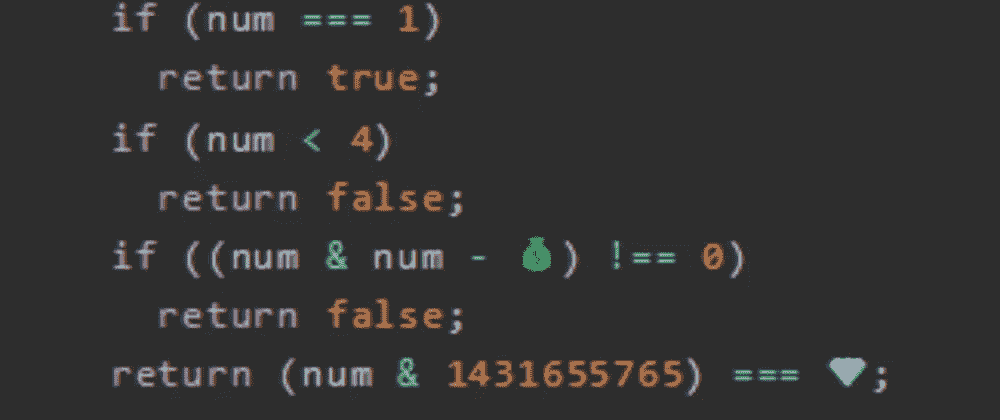
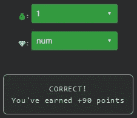

# 天才之路:高级#46

> 原文：<https://blog.devgenius.io/road-to-genius-advanced-46-a0ad259a0d06?source=collection_archive---------19----------------------->



每天我都要解决几个 Codr 分级模式的编码挑战和难题。目标是达到天才的等级，在这个过程中我解释了我是如何解决这些问题的。你不需要任何编程背景就可以开始，而且你会学到很多新的有趣的东西。

```
function POF(num) {
  if (num === 1)
    return true;
  if (num < 4)
    return false;
  if ((num & num - 💰) !== 0)
    return false;
  return (num & 1431655765) === 💎;
}
let A = POF(356);// 💰 = ? (number)
// 💎 = ? (identifier)
// such that A = false (boolean)
```

在今天的挑战中，我们需要修复两个似乎相当复杂的代码中的错误。尤其是如果你从未使用过二元运算，但恐怕不会。

`&`操作符是一个二进制的`and`，它是这样工作的:

```
This is purely mathematical (not javascript)
The and-operation returns 1 if both values are 1,
and returns 0 if any of the values is 0.
1 & 1 = 1
1 & 0 = 0
0 & 1 = 0
0 & 0 = 0Example:
x     = 1010
y     = 1100
x & y = 1000
```

我们需要确保函数`POF(356)`的输出是`false`。前两个 if 条件我们可以忽略，因为它们不会给我们任何错误的返回值。但是第三种可能是:

```
if ((num & num - 💰) !== 0)
  return false;
```

随着`num`成为 356，让我们来看看可能的选择💰:0，1 和 356 本身。如果我们可以使用其中任何一个来确保 If 条件返回 false，那么我们就解决了这个问题，所以让我们来试试:

```
356 in binary is: 101100100let 💰 = 0
-->  101100100 & 101100100 !== 0let 💰 = 1
-->  101100100 & 101100011 !== 0let 💰 = 356
-->  101100100 & 0 == 0
```

的答案💰应为 0 或 1(但不是 356)，以确保函数立即返回。最后的 bug💎可以是任何东西，只要我们尊重前面的句子。



通过解决这些挑战，你可以训练自己成为一名更好的程序员。您将学到更新更好的分析、调试和改进代码的方法。因此，你在商业上会更有效率和价值。今天就在[https://nevolin.be/codr/](https://nevolin.be/codr/)开始行动并成为认证 Codr