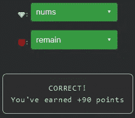

# 天才之路:高级#47

> 原文：<https://blog.devgenius.io/road-to-genius-advanced-47-951584cc963e?source=collection_archive---------18----------------------->


每天我都要解决几个 Codr 分级模式的编码挑战和难题。目标是达到天才的等级，在这个过程中我解释了我是如何解决这些问题的。你不需要任何编程背景就可以开始，而且你会学到很多新的有趣的东西。

```
function backtrack(list, tempList, nums, remain, start) {
  if (remain < 0)
    return;
  else if (remain === 0)
    return list.push([...tempList]);
  for (let i = start; i < 💎.length; i++) {
    tempList.push(nums[i]);
    backtrack(list, tempList, nums, 😈 - nums[i], i);
    tempList.pop();
  }
}
function combS(arr, T) {
  const list = [];
  backtrack(list, [], arr.sort((a, b) => a - b), T, 0);
  return list;
}
let A = combS([2, 3, 4], 6);
A = A.length;// 💎 = ? (identifier)
// 😈 = ? (identifier)
// such that A = 3 (number)
```

我记得这段代码，我们在第 37 集([https://dev.to/codr/road-to-genius-advanced-37-104d](https://dev.to/codr/road-to-genius-advanced-37-104d))遇到过。所以我们今天不必重新发明轮子。

我们从过去的经验中了解到，这种回溯算法是由数组中所有可能的组合组成一个数组，以达到某个目标数。在这种特殊情况下，有 3 种(`A=3`)可能的方法来产生数字为 2、3 和 4 的 6:

```
6 = 2 + 2 + 2
6 = 3 + 3
6 = 4 + 2
```

虫子💎应该是`nums`,因为那是我们正在迭代的。
和😈应该是`remain`,因为在每个递归步骤中，它都从余数中减去一个数。



通过解决这些挑战，你可以训练自己成为一名更好的程序员。您将学到更新更好的分析、调试和改进代码的方法。因此，你在商业上会更有效率和价值。今天就在[https://nevolin.be/codr/](https://nevolin.be/codr/)开始行动，成为一名认证 Codr