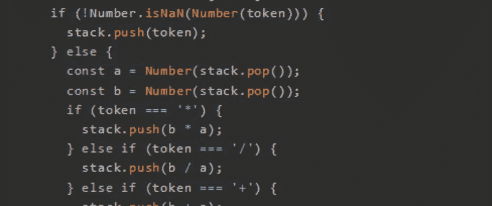
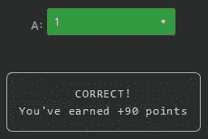
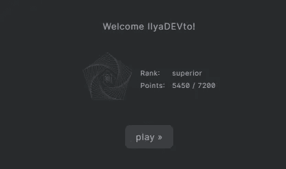

# 天才之路:高级#48

> 原文：<https://blog.devgenius.io/road-to-genius-advanced-48-ad5b9ab619af?source=collection_archive---------19----------------------->



每天我都要解决几个 Codr 分级模式的编码挑战和难题。目标是达到天才的等级，在这个过程中我解释了我是如何解决这些问题的。你不需要任何编程背景就可以开始，而且你会学到很多新的有趣的东西。

```
function RPN(tokens) {
  const stack = [];
  for (let index = 0; index < tokens.length; index++) {
    const token = tokens[index];
    if (!Number.isNaN(Number(token))) {
      stack.push(token);
    } else {
      const a = Number(stack.pop());
      const b = Number(stack.pop());
      if (token === '*') {
        stack.push(b * a);
      } else if (token === '/') {
        stack.push(b / a);
      } else if (token === '+') {
        stack.push(b + a);
      } else if (token === '-') {
        stack.push(b - a);
      }
    }
  }
  return stack.pop();
}let arr = ['1', '6', '9', '/', '+']
let A = RPN(arr);
A = Math.floor(A)// A = ? (number)
```

我们又见到了我们的老朋友反向波兰符号(RPN)。上次我们没有分析它，因为我们已经完全解决了它，所以这次我们必须做它。

RPN 接受的输入是:

```
arr = ['1', '6', '9', '/', '+']
```

该函数从声明一个空数组`stack`开始。然后，它使用 for 循环遍历所有输入标记。让我们用伪代码回顾一下这个过程:

```
stack = []token = 1 --> is number --> push
stack = [1]token = 6 --> is number --> push
stack = [1, 6]token = 9 --> is number --> push
stack = [1, 6, 9]token = / --> non number
a = 9
b = 6
push(6 / 9)
stack = [1, 0.66667]token = + --> non number
a = 0.66667
b = 1
push(0.66667 + 1)
stack = [1.666667]return stack.pop() --> 1.666667A = Math.floor(1.66667) = 1
```

这并不难，不是吗？:)



我们终于升到了下一级“高级”，我很期待下一个挑战！



通过解决这些挑战，你可以训练自己成为一名更好的程序员。您将学到更新更好的分析、调试和改进代码的方法。因此，你在商业上会更有效率和价值。今天就在[https://nevolin.be/codr/](https://nevolin.be/codr/)开始行动并成为认证 Codr