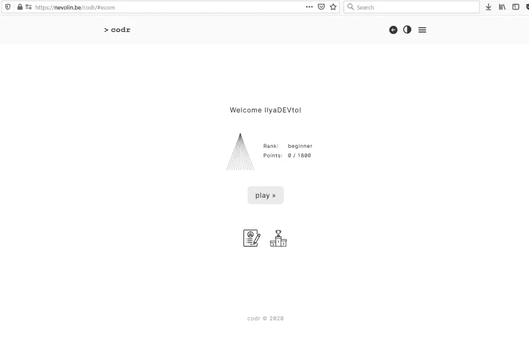
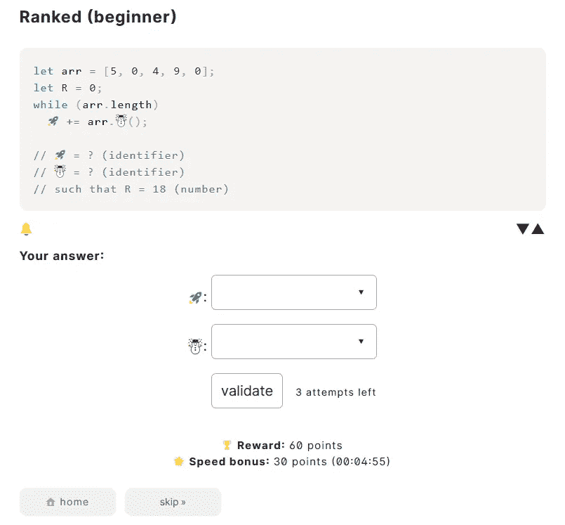
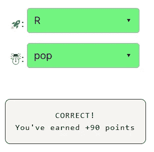

# 天才之路:初学者 1

> 原文：<https://blog.devgenius.io/road-to-genius-beginner-1-84b0b8717bdd?source=collection_archive---------38----------------------->

[Unsplash](https://unsplash.com?utm_source=medium&utm_medium=referral) 上的[窗口](https://unsplash.com/@windows?utm_source=medium&utm_medium=referral)拍照

这是我的“天才之路”系列的第一篇文章。每天我都要解决几个来自 Codr 排名模式的挑战和难题。目标是达到天才的等级，在这个过程中我解释了我是如何解决这些问题的。你不需要任何编程背景就可以开始，但是你会学到很多新的有趣的东西。

我已经用用户名“IlyaDEVto”创建了一个全新的帐户，现在让我们点击播放开始吧。

第一个挑战非常简单，我们可以选择的答案数量有限，这让我们的生活变得简单。现在让我们看一下代码，第一行创建了一个名为`arr`的数组，数组中有特定的值(5，0，4，9，0)，然后我们有一个值为零的变量`R`。然后我们有一个`while`循环，它的条件基于数组的长度。只要`arr`不为空，这个循环就会执行下一行代码。挑战在于修复两个错误(由🚀还有☃️).

去寻找🚀，我们必须看问题(这是最后一行的注释)，它说`such that R=18 (number)`。我们知道最初的`R`值是零，所以代码必须改变`R`以使它最终变成 18。如果你对`arr`中的所有值求和，你会注意到它们的总和是 18。如果你已经知道一点点编码，你可以看到这一点🚀应该是`R`，因为 while 循环下的那行代码就是这么做的。

要找到☃️，你可以看看这些答案(r，arr 和 pop)。r 和 arr 都是变量，使用它们是没有意义的，因为例如代码`🚀 += arr.arr();`是不正确的，会抛出一个错误，`()`括号表示一个函数调用，所以我们拥有的唯一函数是`pop`。这将从`arr`中删除最后一项并返回其值。该值被添加到🚀，我们已经知道是`R`。

因此，错误的一行变成:`R += arr.pop();`就这样，我们解决了我们的第一个挑战。

如果你已经懂一点编程，解决这个问题应该不超过 10 秒钟，写这整个描述只是为了给非程序员一个详细的解释。

如果你觉得有灵感和动力去升级你的编码和调试技能，在[https://nevolin.be/codr/](https://nevolin.be/codr/)加入我的天才之路