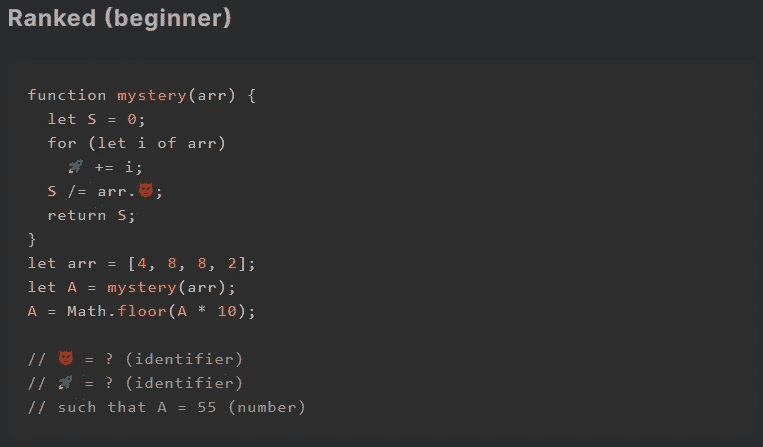

# 天才之路:初学者#10

> 原文：<https://blog.devgenius.io/road-to-genius-beginner-10-7b929286f0e3?source=collection_archive---------36----------------------->

每天我都要解决几个来自 Codr 排名模式的挑战和难题。目标是达到天才的等级，在这个过程中我解释了我是如何解决这些问题的。你不需要任何编程背景就可以开始，但是你会学到很多新的有趣的东西。

这个挑战从声明一个函数`mystery`开始，带有一个参数`arr`，这个参数很可能是一个数组。在函数之后，它创建一个数组，然后调用函数，函数的结果进入变量`A`。幸运的是，我们不必计算这段代码做的所有事情，只需修复两个错误(😈和🚀).去寻找🚀你可以分析函数的前三行代码，它从初始化变量`S=0`开始，然后我们看到`🚀 += i`，所以🚀很可能会是`S`。然后下一行是`S /= arr.😈;`，😈似乎是数组对象的一个属性，答案中唯一有效的属性似乎是`length`。

如果你更仔细地分析一下`mystery`实际上做了什么:它把来自`arr`的所有值加到`S`中，然后把这个和除以数组的长度。换句话说，它在计算`arr`中所有数字的平均值。

如果你觉得有灵感和动力去升级你的编码和调试技能，在[https://nevolin.be/codr/](https://nevolin.be/codr/)加入我的天才之路