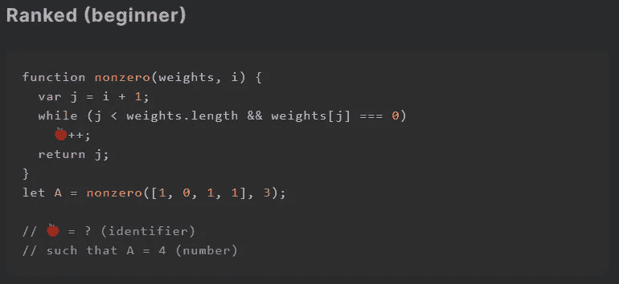
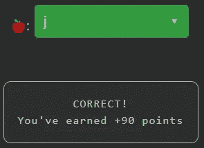

# 天才之路:初学者#11

> 原文：<https://blog.devgenius.io/road-to-genius-beginner-11-d1979603cdc7?source=collection_archive---------25----------------------->

每天我都要解决几个来自 Codr 排名模式的挑战和难题。目标是达到天才的等级，在这个过程中我解释了我是如何解决这些问题的。你不需要任何编程背景就可以开始，但是你会学到很多新的有趣的东西。

这个挑战很简单，但会让你三思。

它从一个函数`nonzero`开始，这个函数有两个参数`weights`和`i`。然后它声明了一个变量`j = i+1`，后面是一个 while 循环，其中有一行错误的代码作为主体:`🍎++;`。虫子🍎可以是几种东西，可以是`j`、`i`或者`weights`。但是由于参数`weights`被用作数组，它不太可能是正确的答案。现在我们必须在`j`和`i`之间做出选择，为了解决这个问题，让我们开始分析最少出现的参数`i`，它在`j`的初始化过程中只使用过一次，显然没有进一步的用途。因此🍎很可能是`j`,因为它也在 while 条件中显式使用。

如果你觉得有灵感和动力去升级你的编码和调试技能，在[https://nevolin.be/codr/](https://nevolin.be/codr/)加入我的天才之路