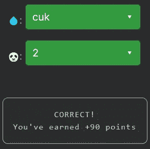

# 天才之路:初学者#12

> 原文：<https://blog.devgenius.io/road-to-genius-beginner-12-b242eaa8b422?source=collection_archive---------27----------------------->

每天我都要解决几个来自 Codr 排名模式的挑战和难题。目标是达到天才的等级，在这个过程中我解释了我是如何解决这些问题的。你不需要任何编程背景就可以开始，但是你会学到很多新的有趣的东西。


到目前为止，关于字符串还没有太多像样的挑战。这个挑战由三行代码组成，但是确实需要一些注意，尤其是如果您是编码和/或 javascript 的新手。

我们需要修复两个错误💧和🐼，两者都应该是挑战所要求的字符串。第三行代码是这样的:`R = (A + B)[2]`。它创建了一个变量`R`，其值是一个“复杂的”字符串操作。该操作连接(组合)字符串值`A`和`B`，从这个结果中获取索引 2 处的字符。挑战要求`R`等于`k`，所以这意味着我们需要确保组合字符串中的第二个字符是字符`k`。当我们考虑可能的选择时💧，我们只能找到一个在第二个索引(或第三个位置)包含字符`k`的答案。该值将确保满足最终条件；的价值🐼不再重要，所以我们可以选择任何东西。

示例:

```
let A = 'cuk'
let B = 'pap'
let R = (A+B)[2]    // similar to: R = 'cukpap'[2]
```



如果你感到有灵感和动力去升级你的编码和调试技能，在[https://nevolin.be/codr/](https://nevolin.be/codr/)加入我的天才之路