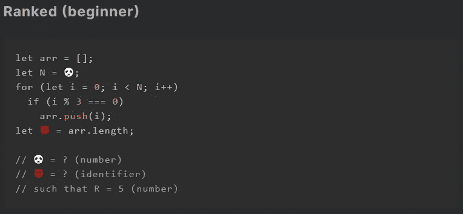
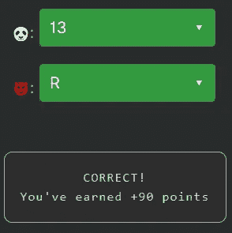

# 天才之路:初学者#13

> 原文：<https://blog.devgenius.io/road-to-genius-beginner-13-82d3957c26b0?source=collection_archive---------34----------------------->

每天我都要解决几个来自 Codr 排名模式的挑战和难题。目标是达到天才的等级，在这个过程中我解释了我是如何解决这些问题的。你不需要任何编程背景就可以开始，但是你会学到很多新的有趣的东西。

我们即将从“初学者”升级到“聪明”等级，只剩下几个问题了。我对这个新的挑战感到兴奋。我们以前在稍微不同的版本中看到过这个代码。我们需要修复两个错误🐼和😈。第一个似乎是变量`N`的初始值，用作 for 循环中的条件。在循环内部，我们用数字填充数组，条件是`i % 3 == 0`。这意味着，如果我们将`i`除以 3，余数应该是零，换句话说，除法应该得到一个整数。3 的整数除法是:0，3，6，9，...

挑战在最后声明`R = 5`，因为在那之前 R 还没有被声明😈最有可能的是`R`。如果我们看一看可能的答案🐼，我们看`0, 5 and 13`。前两个是不正确的，因为这些条件不会为数组生成足够的数字来包含 5 个项目(由`R`表示)。唯一有效的答案是 13 我们可以证明:0，3，6，9，12 是能被 3 整除的五个数(余数是 0)。

如果你觉得有灵感和动力去提升你的编码和调试技能，在[https://nevolin.be/codr/](https://nevolin.be/codr/)加入我的天才之路