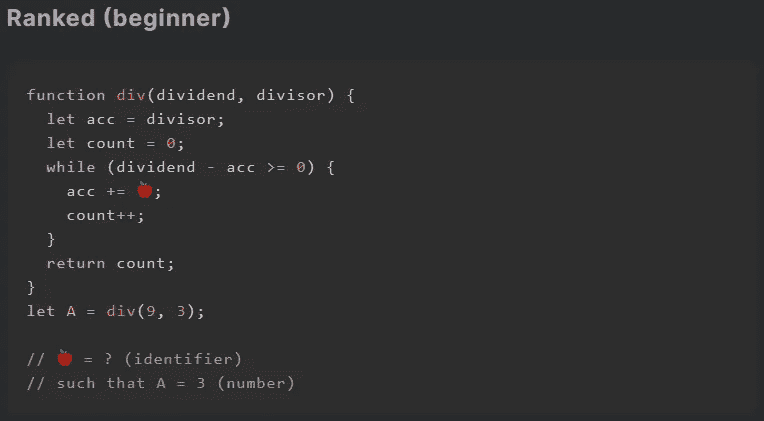
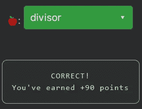

# 天才之路:初学者#14

> 原文：<https://blog.devgenius.io/road-to-genius-beginner-14-4c916a0fdda2?source=collection_archive---------42----------------------->

每天我都要解决几个来自 Codr 排名模式的挑战和难题。目标是达到天才的等级，在这个过程中我解释了我是如何解决这些问题的。你不需要任何编程背景就可以开始，但是你会学到很多新的有趣的东西。

这是我们到达下一个等级之前的最后一个挑战，这是一个非常好的挑战。我们只需要修复一个错误🍎完成挑战。

代码从一个带两个参数`dividend`和`divisor`的函数`div`开始，这已经揭示了函数的本质。有问题的行是`acc += 🍎;`，基本上我们需要弄清楚哪个值/变量用于求和。这既可以是`dividend, divisor, count or acc itself`。通过查看 while 循环的条件，它是`(dividend - acc >= 0)`。由此我们可以断定`acc`需要保持在`dividend`的值以下，所以我们可以排除`dividend`作为答案。变量 count 好像是用来统计`divisor`装进`dividend`的次数的，我们也把它排除掉吧。

让我们看看如果我们使用`acc`作为🍎，从值 3 (= `divisor`)开始，会演化为:3 - > 6 - > 12 - > 24。和写`acc *= 2`一样。在这种情况下，`count`将仅达到值 2(而不是挑战所要求的值 3:`A=3`)。

另一方面，如果我们用`divisor`来表示🍎，就会演化为:3 - > 6 - > 9 - > 12。在这种情况下，一旦`acc`变为 9，while 循环将结束，计数将为 3(因此`A=3`)。

如果你觉得有灵感和动力去升级你的编码和调试技能，在[https://nevolin.be/codr/](https://nevolin.be/codr/)加入我的天才之路