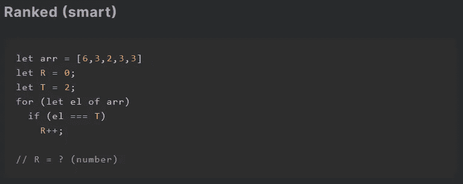
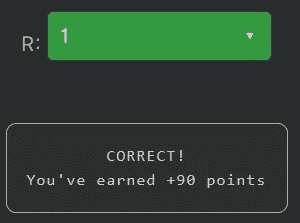

# 天才之路:初学者#15

> 原文：<https://blog.devgenius.io/road-to-genius-beginner-15-41a8b3d6491f?source=collection_archive---------41----------------------->

每天我都要解决几个 Codr 分级模式的编码挑战和难题。目标是达到天才的等级，在这个过程中我解释了我是如何解决这些问题的。你不需要任何编程背景就可以开始，而且你会学到很多新的有趣的东西。

从“聪明”阶层开始，我们将会遇到实际上必须全面分析和解决的问题，而不仅仅是修复几个 bug。

上面的代码从创建一个数字数组开始，然后声明两个变量`R=0`和`T=2`。此外，我们有一个带条件`R++`操作的 for 循环，只有当`el`等于`T`时才会执行。由于代码简单，我们可以将算法总结如下:代码计算(使用`R`)数组中数字`T`的出现次数。

由于`T=2`，我们看到 2 在数组中只出现一次，所以`R`应该是 1:

如果你感到有灵感和动力去升级你的编码+调试技能，在[https://nevolin.be/codr/](https://nevolin.be/codr/)加入我的天才之路