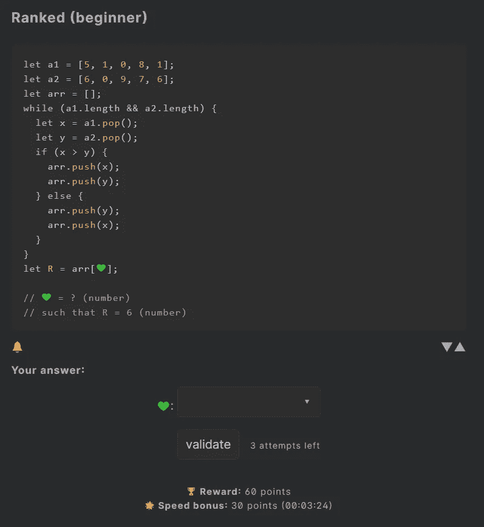
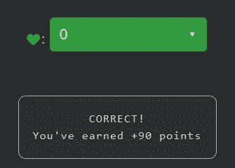

# 天才之路:初学者 2

> 原文：<https://blog.devgenius.io/road-to-genius-beginner-2-f0e49de510b3?source=collection_archive---------43----------------------->

每天我都要解决几个来自 Codr 排名模式的挑战和难题。目标是达到天才的等级，在这个过程中我解释了我是如何解决这些问题的。你不需要任何编程背景就可以开始，但是你会学到很多新的有趣的东西。



这个挑战比前一个稍微复杂一些。不要被代码量迷惑，我们来解剖一下挑战。

正如你在底部评论中看到的，我们只需要解决一个 bug💚(一个数字)，然后我们得到一个可供选择的答案列表。

代码从创建 3 个数组开始，前两个(`a1`和`a2`)用数字填充，第三个`arr`为空。然后我们有一个 while 循环，它的条件是`a1`和`a2`的长度。这意味着，只要这两个数组不为空，它就会执行循环`{...}`中的代码。

这个内码分别从`a1`和`a2`弹出到`x`和`y`变量中。然后比较`x`和`y`，如果`x`大于`y`，则先将`x`加到`arr`再加到`y`，否则先加`y`再加`x`。这就是我们需要知道的一切。

挑战还指出`R`应该是 6。`R`是来自`arr`的未知位置的值(=索引)，由我们的 bug 表示💚(一个数字)。所以我们所需要的就是找到一个索引`arr`，使得该索引处的值为 6。

这里有一个例子:
`let demo = [2, 4, 6]`
一个数组是零索引的，意思是第一个元素在位置(索引)0，第二个元素在索引 1，依此类推...
在本例中，值 6 位于索引 2 处。

现在回到我们的挑战。我们知道，循环从两个不同的数组中获取元素，并将它们添加到一个新的数组中，我们所需要的就是找到值 6 的位置(索引)。请注意，有两个可能的答案，因为数字 6 在`a2`中出现了两次。但是我们非常幸运，因为这些数字中的一个出现在`a2`的最后。我们需要做的就是对内部循环求值一次来找到索引，就像这样:

```
x = 1   (pop from a1)
y = 6   (pop from a2)
if (x > y)    this is false
...
else {        here we go
  arr.push(y)
  arr.push(x)
}'arr' is now [6, 1]
```

值 6 位于 arr 中的索引/位置 0。这意味着💚应该是 0。



如果你觉得有灵感和动力去升级你的编码和调试技能，在[https://nevolin.be/codr/](https://nevolin.be/codr/)加入我的天才之路