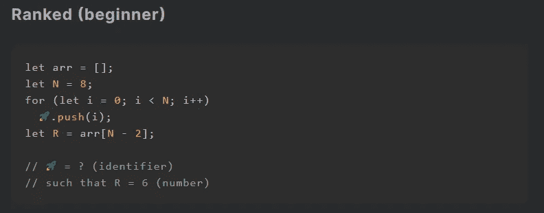
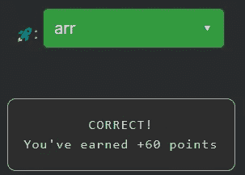

# 天才之路:初学者 3

> 原文：<https://blog.devgenius.io/road-to-genius-beginner-3-35516e22f39?source=collection_archive---------33----------------------->

每天我都要解决几个来自 Codr 排名模式的挑战和难题。目标是达到天才的等级，在这个过程中我解释了我是如何解决这些问题的。你不需要任何编程背景就可以开始，但是你会学到很多新的有趣的东西。

太好了，又一个简单的挑战，只有五行代码和一个 bug(🚀)来修复。为了解决这个挑战，我们不需要投入太多的智力。如果你仔细观察 bug 行，你会发现 bug🚀表示某种具有可用的`push(...)`函数的对象。根据经验，我们知道`push`和`pop`函数通常与数组相关联，我们代码中唯一的数组是`arr`，所以🚀是`arr`。

即使你在没有完全阅读/理解代码的情况下设法解决了一个挑战，事后仔细看看也无妨。

这段代码将数字加到`arr`中，最后`R`在索引`N-2`处从`arr`中获取值。显然这个值是 6，因为它是给定的，但是你也可以手动计算。一种方法是理解 for 循环正在做什么:它将数字从 0 到 7(包括 0 和 7)推入到`arr`中，因此总共向数组中添加了 8 个数字(= `N`)。这意味着索引 7 是数组的最后一项(= `N-1`)，因此索引`N-2`保存值 6。

如果你感到有灵感和动力去升级你的编码和调试技能，在[https://nevolin.be/codr/](https://nevolin.be/codr/)加入我的天才之路