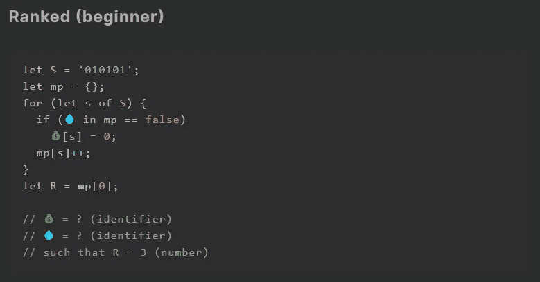
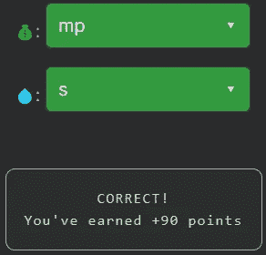

# 天才之路:初学者#4

> 原文：<https://blog.devgenius.io/road-to-genius-beginner-4-ab79843eef70?source=collection_archive---------31----------------------->

每天我都要解决几个来自 Codr 排名模式的挑战和难题。目标是达到天才的等级，在这个过程中我解释了我是如何解决这些问题的。你不需要任何编程背景就可以开始，但是你会学到很多新的有趣的东西。



这是一个非常有趣的挑战。到目前为止，我们还没有谈到 JavaScript 对象。一个对象是一个可以在内部保存不同变量的“东西”。为了说明这一点，假设我们有一个叫做“动物”的物体，一个动物可以有颜色、身高和体重。在 JavaScript 代码中，我们的动物对象如下所示:

```
animal = {
  color: 'black',
  height: 50,
  weight: 100
}
```

我们可以像这样访问和改变一个对象的内部元素(=成员):`animal.height = 70`。我们还可以从对象中创建和删除成员，让我们像这样给我们的动物添加一个`type`成员:`animal['type'] = 'panther'`。

现在回到我们的挑战，我们必须修复两个错误(💰和💧)在代码中，这样`R`产生 3。您不必开始执行代码来解决挑战，这里只需要一点点洞察力就足够了。

其中一个错误行是:`if (💧 in mp == false)`，基本上它检查标识符是否💧(很可能是一个变量)不在我们的对象`mp`中。换句话说，它检查`mp`是否缺少由💧。现在我们还不能确定是什么💧应该是，直到我们调查下一条线。

下一个有问题的行是`💰[s] = 0;`，它在💰归零。如果你有一点点的编程经验，你应该意识到这两行是非常相关的。标识符💰应该是`mp`，而💧应该是`s`。



你可能会问，但是为什么呢？答案需要你完全理解代码。我们使用对象`mp`来跟踪字符串`S`中出现的字符，在本例中是`010101`。代码所做的就是遍历字符串中的每个字符，并计算每个字符出现的次数。运行此代码后，对象将如下所示:

```
mp = {
   '0': 3, 
   '1': 3,
}
```

每个字符在字符串`S`中出现 3 次。这就是为什么`R == mp[0] == 3`。

如果你感到有灵感和动力去升级你的编码和调试技能，在[https://nevolin.be/codr/](https://nevolin.be/codr/)加入我的天才之路