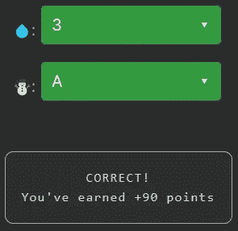

# 天才之路:初学者#5

> 原文：<https://blog.devgenius.io/road-to-genius-beginner-5-e8ad3d9409bc?source=collection_archive---------47----------------------->

每天我都要解决几个来自 Codr 排名模式的挑战和难题。目标是达到天才的等级，在这个过程中我解释了我是如何解决这些问题的。你不需要任何编程背景就可以开始，但是你会学到很多新的有趣的东西。

这是一个简单的挑战。我们得到三个数字(A，B，C ),然后用在一个数学表达式中。表达式的结果存储在变量 r 中。

我们得到的错误线是:`let R = (☃️ + B + C) / 💧;`
我们也知道 R = 5(它是给定的)，现在我们要确定☃️和💧应该是。由于我们有两个未知数，但只有一个方程，我们必须进行计算猜测。我们看到`A+B+C = 15`。因为 R 必须是 5，那么我们可以💧be 3，这是这种情况下一个可能的答案。

注意:我们可以忽略`Math.floor(R)`码，它是用来舍入小数的；因为 15 是一个整数，所以无关紧要。

太好了！继续下一个。

如果你觉得有灵感和动力去升级你的编码和调试技能，在 https://nevolin.be/codr/[和我一起踏上天才之路](https://nevolin.be/codr/)