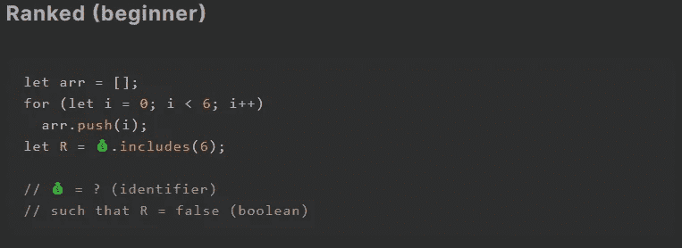
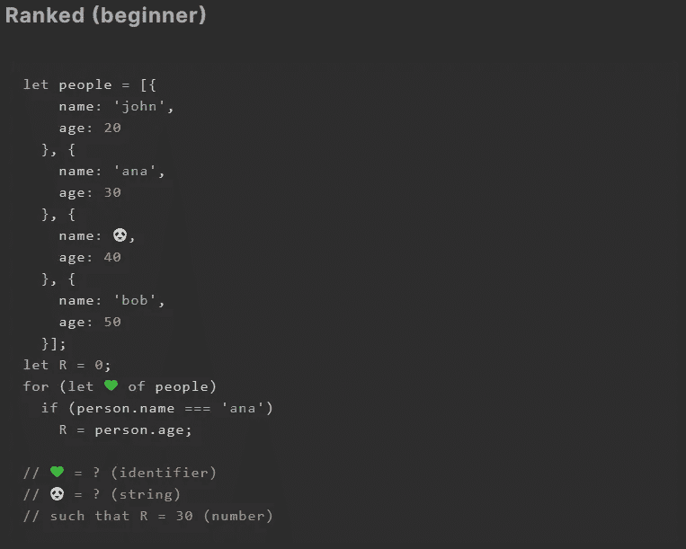
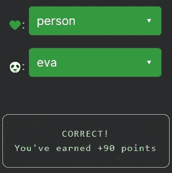

# 天才之路:初学者#6

> 原文：<https://blog.devgenius.io/road-to-genius-beginner-6-d6f2190432e1?source=collection_archive---------48----------------------->

由 [Alexandru Acea](https://unsplash.com/@alexacea?utm_source=medium&utm_medium=referral) 在 [Unsplash](https://unsplash.com?utm_source=medium&utm_medium=referral) 上拍摄的照片

每天我都要解决几个来自 Codr 排名模式的挑战和难题。目标是达到天才的等级，在这个过程中我解释了我是如何解决这些问题的。你不需要任何编程背景就可以开始，但是你会学到很多新的有趣的东西。

在这篇文章中，我将讨论两个挑战，因为第一个很短；)

在第一个挑战中，我们得到一个数组，使用 for 循环填充数字。最后，我们通过检查以下条件来计算`R`的值💰包括数字 6。任务是找到什么标识符💰是。但是我已经破坏了，这是我们填充的数组。好了，完成了！

第二个挑战只是比第一个稍微复杂一点。代码多了一点，但解决起来仍然很简单。任务是修复两个错误(💚和🐼)，这样`R = 30`。前几行代码创建了一个由 4 个对象组成的数组`people`。如果你观察这些物体的成员，它们是`name`和`age`，看起来物体代表一个人。然后我们看到有一个 for 循环，遍历数组中的所有对象，这一行包含第一个 bug💚，我们可以有把握地假设💚应该是变量`person`因为下面要用到。接下来，if 条件检查这个人的名字是否等于`ana`，如果是，则`R`获得这个人的年龄值。如果我们回头看看我们的人群，名为`ana`的人已经 30 岁了，正如我们所料。

但是，嘿，关于什么🐼？在这种情况下，什么无关紧要🐼应该是，只要确定不是`ana`就可以保证`R=30`是真的。

如果你觉得有灵感和动力去提升你的编码和调试技能，在[https://nevolin.be/codr/](https://nevolin.be/codr/)加入我的天才之路