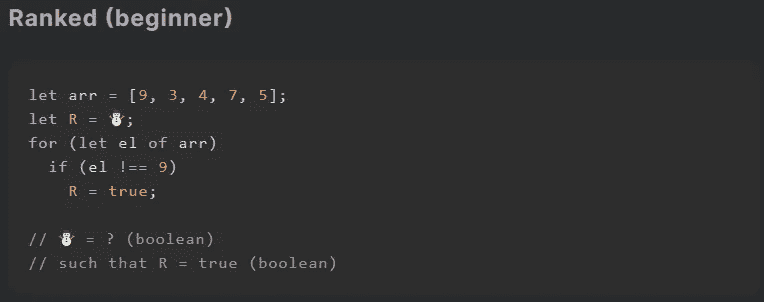
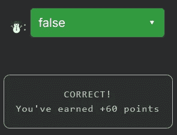
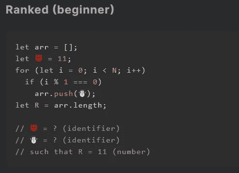
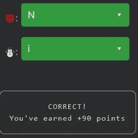

# 天才之路:初学者#7

> 原文：<https://blog.devgenius.io/road-to-genius-beginner-7-b86887b31147?source=collection_archive---------34----------------------->

每天我都要解决几个来自 Codr 排名模式的挑战和难题。目标是达到天才的等级，在这个过程中我解释了我是如何解决这些问题的。你不需要任何编程背景就可以开始，但是你会学到很多新的有趣的东西。

在这篇文章中，我将讨论两个挑战，因为第一个挑战很快:

第一个挑战要求我们算出`R`的初始值(☃️).但是因为这个值在后面的代码中会被覆盖，所以初始值并不重要。但是要通过我们的验证标准，它必须是一个布尔值，所以要么`true`要么`false`是正确的。

让我们进入下一个挑战:

这个更令人兴奋。我们需要弄清楚😈和☃️，两者都是标识符，因此`R=11`。去寻找😈你需要分析 for 循环，它包含一个还没有声明的变量`N`，所以😈最有可能是`N`。☃️的标识符并不重要，因为如果你看代码的最后一行`R=arr.length`，挑战只对数组中的项目数量感兴趣，而不是那些值实际上是什么。所以☃️应该是理想的 T7 或 T8。

如果你感到有灵感和动力去升级你的编码+调试技能，在[https://nevolin.be/codr/](https://nevolin.be/codr/)加入我的天才之路