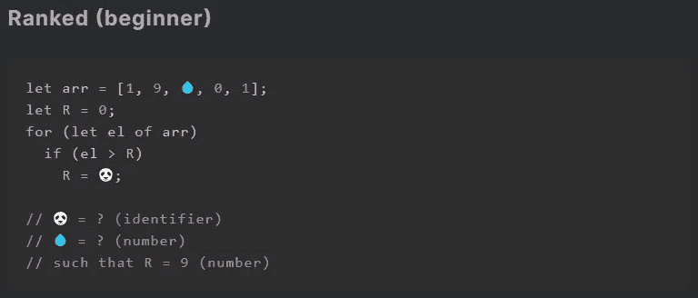
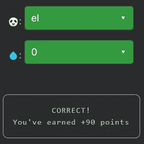

# 天才之路:初学者#8

> 原文：<https://blog.devgenius.io/road-to-genius-beginner-8-4118cf40133b?source=collection_archive---------36----------------------->

每天我都要解决几个来自 Codr 排名模式的挑战和难题。目标是达到天才的等级，在这个过程中我解释了我是如何解决这些问题的。你不需要任何编程背景就可以开始，但是你会学到很多新的有趣的东西。

在这个挑战中，我们必须修复两个错误(🐼和💧).第一行代码创建一个数字数组，其中💧是一个未知数，也可能是一个数字。再往下我们有一个 for 循环，遍历数组中的每个数字。然后将每个数字与`R`进行比较。如果数字大于`R`，则`R`变为🐼。简而言之，这个简单的算法跟踪数组中的最大值，并且🐼最有可能是`el`。

如果你看了最后一条评论，挑战声明`R should be 9`。如果我们回头看看我们的数组，我们会看到数字 9 已经存在，所以不管是什么💧的值应该是。

如果你觉得有灵感和动力去升级你的编码和调试技能，在[https://nevolin.be/codr/](https://nevolin.be/codr/)加入我的天才之路