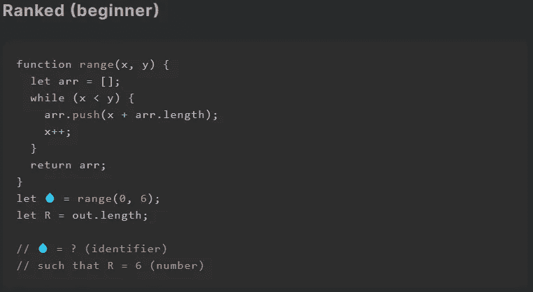
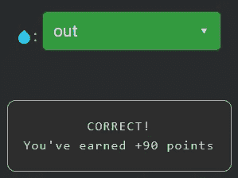

# 天才之路:初学者 9

> 原文：<https://blog.devgenius.io/road-to-genius-beginner-9-2efa7ee00d38?source=collection_archive---------35----------------------->

每天我都要解决几个来自 Codr 排名模式的挑战和难题。目标是达到天才的等级，在这个过程中我解释了我是如何解决这些问题的。你不需要任何编程背景就可以开始，但是你会学到很多新的有趣的东西。

这次挑战比我们之前遇到的所有挑战都要复杂一些。解决它是非常容易的，因为你不需要完全阅读代码。我们需要修复这个 bug💧，它用在代码末尾附近。好像只是一个变量名，它的值是通过调用函数得到的。去寻找💧，我们可以看下一行，这里有一个还没有声明的变量`out`,所以💧必须是`out`。

解决这个挑战是小菜一碟，但是让我们分析一下代码，特别是函数`range`。这个函数有两个参数`x`和`y`。它声明了一个空数组，然后有一个 while 循环，运行时间与`x < y`一样长。在循环内部，它向数组添加一个数字`x + arr.length`，然后将`x`的值加 1。最后它返回数组`arr`。因此💧(= `out`)指向数组(通过引用)。

如果你觉得有灵感和动力去升级你的编码和调试技能，在[https://nevolin.be/codr/](https://nevolin.be/codr/)加入我的天才之路