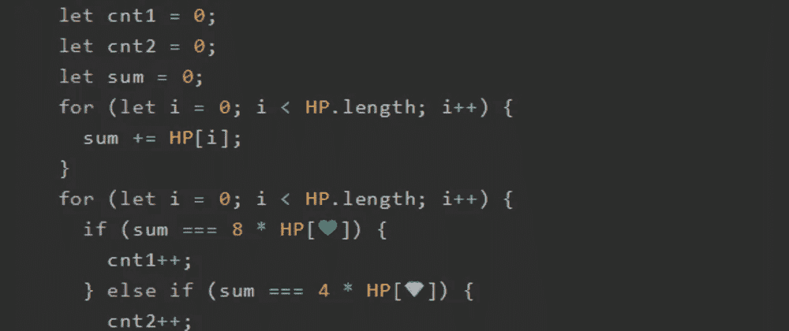
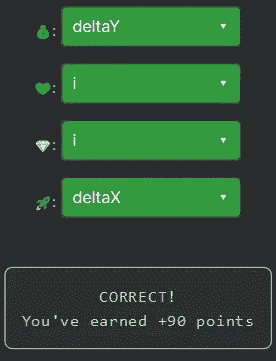

# 天才之路:天才#67

> 原文：<https://blog.devgenius.io/road-to-genius-genius-67-6372adc4a471?source=collection_archive---------9----------------------->



每天我都要解决几个 Codr 分级模式的编码挑战和难题。目标是达到天才的等级，在这个过程中我解释了我是如何解决这些问题的。你不需要任何编程背景就可以开始，而且你会学到很多新的有趣的东西。

我们终于到达了天才等级，这是最高等级的第一次挑战。我希望你和我一样兴奋。我会继续做更多的日常挑战。

```
function helper(p1, p2) {
  const deltaX = p1[0] - p2[0];
  const 💰 = p1[1] - p2[1];
  return 🚀 * deltaX + deltaY * deltaY;
}
function checker(p1, p2, p3, p4) {
  const HP = [helper(p1, p2), helper(p1, p3), helper(p1, p4), helper(p2, p3), helper(p2, p4), helper(p3, p4)];
  let cnt1 = 0;
  let cnt2 = 0;
  let sum = 0;
  for (let i = 0; i < HP.length; i++) {
    sum += HP[i];
  }
  for (let i = 0; i < HP.length; i++) {
    if (sum === 8 * HP[💚]) {
      cnt1++;
    } else if (sum === 4 * HP[💎]) {
      cnt2++;
    }
  }
  return cnt1 === 4 && cnt2 === 2;
}
let p1 = [6, 9], p2 = [3, 1];
let p3 = [7, 0], p4 = [3, 7];
let A = checker(p1, p2, p3, p4);// 💰 = ? (identifier)
// 💚 = ? (identifier)
// 💎 = ? (identifier)
// 🚀 = ? (identifier)
// such that A = false (boolean)
```

在这个挑战中，我们需要修复四个 bug，快速查看代码后，这应该是一个简单的过程。

前两个 bug 出现在同一个短函数`helper`中:

```
function helper(p1, p2) {
  const deltaX = p1[0] - p2[0];
  const 💰 = p1[1] - p2[1];
  return 🚀 * deltaX + deltaY * deltaY;
}
```

的变量声明💰应该是`deltaY`，而且🚀很有可能是`deltaX`因为函数似乎是在计算`dx² + dy²`。

最后两个错误出现在这里:

```
for (let i = 0; i < HP.length; i++) {
    if (sum === 8 * HP[💚]) {
      cnt1++;
    } else if (sum === 4 * HP[💎]) {
      cnt2++;
    }
  }
```

这两个 bug 都是数组`HP`的索引。因为两者都在一个没有使用`i`变量的 for 循环中，所以很有可能两个 bug 都应该是`i`。



我们所有的假设都是正确的！我们很可能在不久的将来再次遇到这个函数，所以现在我们跳过对它的详细分析。

通过解决这些挑战，你可以训练自己成为一名更好的程序员。您将学到更新更好的分析、调试和改进代码的方法。因此，你在商业上会更有效率和价值。今天就在[https://nevolin.be/codr/](https://nevolin.be/codr/)开始行动，成为一名认证 Codr