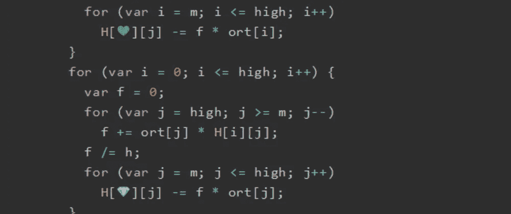
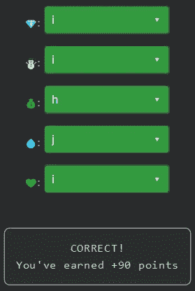

# 天才之路:天才#68

> 原文：<https://blog.devgenius.io/road-to-genius-genius-68-e17eb3666da0?source=collection_archive---------10----------------------->



每天我都要解决几个 Codr 分级模式的编码挑战和难题。目标是达到天才的等级，在这个过程中我解释了我是如何解决这些问题的。你不需要任何编程背景就可以开始，而且你会学到很多新的有趣的东西。

```
function science_lin_decomposeOrthes(H, V) {
  var n = H.length;
  var ort = [];
  var low = 0;
  var high = n - 1;
  for (var m = low + 1; m < high; m++) {
    var scale = 0;
    for (var i = m; i <= high; i++)
      scale += Math.abs(H[i][m - 1]);
    if (scale !== 0) {
      var h = 0;
      for (var i = high; i >= m; i--) {
        ort[i] = H[i][m - 1] / scale;
        h += ort[i] * ort[i];
      }
      var g = Math.sqrt(💰);
      if (ort[m] > 0)
        g = -g;
      h = h - ort[m] * g;
      ort[m] = ort[m] - g;
      for (var j = m; j < n; j++) {
        var f = 0;
        for (var i = high; i >= m; i--)
          f += ort[i] * H[i][j];
        f /= h;
        for (var i = m; i <= high; i++)
          H[💚][j] -= f * ort[i];
      }
      for (var i = 0; i <= high; i++) {
        var f = 0;
        for (var j = high; j >= m; j--)
          f += ort[j] * H[i][j];
        f /= h;
        for (var j = m; j <= high; j++)
          H[💎][j] -= f * ort[j];
      }
      ort[m] = scale * ort[m];
      H[m][m - 1] = scale * g;
    }
  }
  for (var i = 0; i < n; i++) {
    for (var j = 0; j < n; j++)
      V[i][j] = i === 💧 ? 1 : 0;
  }
  for (var m = high - 1; m >= low + 1; m--) {
    if (H[m][m - 1] !== 0) {
      for (var i = m + 1; i <= high; i++)
        ort[i] = H[i][m - 1];
      for (var j = m; j <= high; j++) {
        var g = 0;
        for (var i = m; ☃️ <= high; i++)
          g += ort[i] * V[i][j];
        g = g / ort[m] / H[m][m - 1];
        for (var i = m; i <= high; i++)
          V[i][j] += g * ort[i];
      }
    }
  }
}
let x = [[3, 4], [8, 5]];
let y = [[8, 1], [1, 2]];
science_lin_decomposeOrthes(x, y);
let A = x[0][1] + y[0][1];
A = Math.floor(A * 100);
A = Math.abs(A);// 💎 = ? (identifier)
// ☃️ = ? (identifier)
// 💰 = ? (identifier)
// 💧 = ? (identifier)
// 💚 = ? (identifier)
// such that A = 400 (number)
```

好的，这比我们以前用的代码要多得多。我们需要修复五个 bug 来完成挑战，让我们一个一个来。

第一个 bug 出现在这里:

```
var g = Math.sqrt(💰);
```

我不知道什么💰应该是，它在求某个数的根。但我们能看到的是，它之前的每个变量，除了变量`h`，要么是数组，要么是某个索引/指针；所以让我们试试。

接下来的两个 bug 似乎非常相似:

```
for (var j = m; j < n; j++) {
      ...
        for (var i = m; i <= high; i++)
          H[💚][j] -= f * ort[i];
      }
      for (var i = 0; i <= high; i++) {
      ...
        for (var j = m; j <= high; j++)
          H[💎][j] -= f * ort[j];
      }
```

两个 bug💚和💎用于索引一行`H`；`j`用于索引 2d 等级，`i`未使用，只能这样了。

第四个 bug 有点棘手:

```
for (var i = 0; i < n; i++) {
    for (var j = 0; j < n; j++)
      V[i][j] = i === 💧 ? 1 : 0;
  }
```

这行代码用 0 和 1 填充数组`V`。但我觉得它好像是这样做的，对角线只由 1 组成，其他都是 0；为了成功💧应该是`j`。

最后一个 bug 是花生:

```
for (var i = m; ☃️ <= high; i++)
```

这是一个基本的循环条件，☃️应该在这里`i`。



通过解决这些挑战，你可以训练自己成为一名更好的程序员。您将学到更新更好的分析、调试和改进代码的方法。因此，你在商业上会更有效率和价值。今天就在[https://nevolin.be/codr/](https://nevolin.be/codr/)开始行动，成为一名认证 Codr