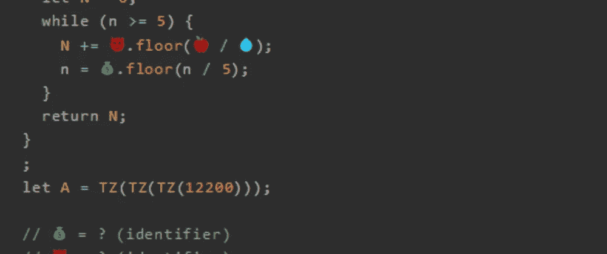
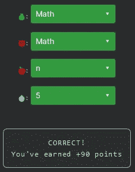

# 天才之路:天才#69

> 原文：<https://blog.devgenius.io/road-to-genius-genius-69-70ff66c8c7a9?source=collection_archive---------14----------------------->



每天我都要解决几个 Codr 分级模式的编码挑战和难题。目标是达到天才的等级，在这个过程中我解释了我是如何解决这些问题的。你不需要任何编程背景就可以开始，而且你会学到很多新的有趣的东西。

```
function TZ(n) {
  let N = 0;
  while (n >= 5) {
    N += 😈.floor(🍎 / 💧);
    n = 💰.floor(n / 5);
  }
  return N;
}
;
let A = TZ(TZ(TZ(12200)));// 💰 = ? (identifier)
// 😈 = ? (identifier)
// 🍎 = ? (identifier)
// 💧 = ? (number)
// such that A = 188 (number)
```

这是一个有趣的挑战，我们必须在很短的代码库中修复 4 个错误。

这四个错误都出现在两个连续的行中。我们立即看到😈和💰应该是`Math`，因为它们使用通用的`floor`函数。最后两个 bug🍎和💧很难找到。然而，如果我们看看💧(数字)显示`12200, 5 and 0`；除以 12200 和 0 意义不大，但是除以 5 也是在下一行代码上完成的。因为💧那么，很可能是 5🍎可能是`n`同样的原因:



通过解决这些挑战，你可以训练自己成为一名更好的程序员。您将学到更新更好的分析、调试和改进代码的方法。因此，你在商业上会更有效率和价值。今天就在 https://nevolin.be/codr/的[开始行动，成为一名认证 Codr](https://nevolin.be/codr/)