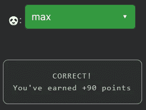

# 天才之路:聪明 16

> 原文：<https://blog.devgenius.io/road-to-genius-smart-16-656d2a1641df?source=collection_archive---------36----------------------->

每天我都要解决几个 Codr 分级模式的编码挑战和难题。目标是达到天才的等级，在这个过程中我解释了我是如何解决这些问题的。你不需要任何编程背景就可以开始，而且你会学到很多新的有趣的东西。

让我们直奔主题吧。我们需要修复一个错误🐼，它应该是一个标识符(很可能是一个变量名)。代码以函数`canJump`开始。如果你分析代码，它似乎是一些奇怪的算法，返回一个布尔值。幸运的是，我们不需要完全理解代码就能完成挑战。

让我们来关注一下`max = Math.max(a, b)`形式的 buggy line。这是一行非常常见的代码，用于在迭代数组时跟踪最大值。在我们的简化形式中，如果`a > b`代码返回`a`，否则返回`b`。在我们的挑战码中，`a`是给定的，`b`是🐼。代码可能会将`a`与当前的`max`值进行比较。因此🐼必须是`max`:

如果你觉得有灵感和动力去升级你的编码和调试技能，在[https://nevolin.be/codr/](https://nevolin.be/codr/)加入我的天才之路