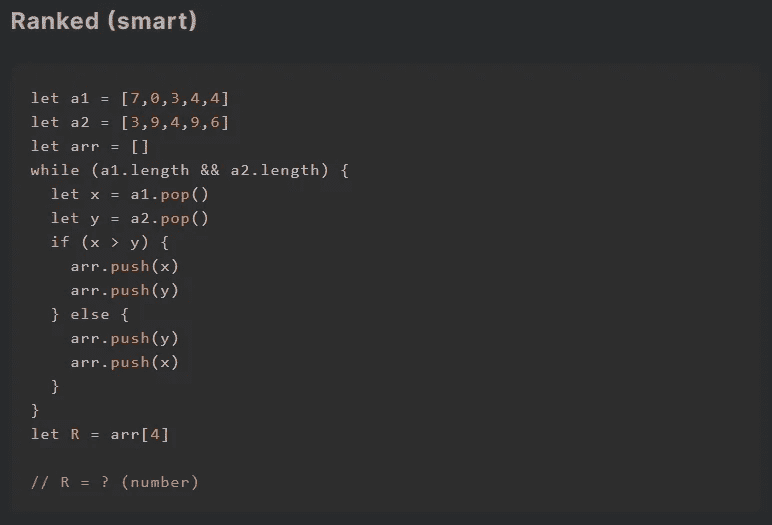
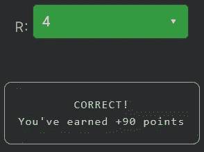

# 天才之路:聪明#17

> 原文：<https://blog.devgenius.io/road-to-genius-smart-17-e6ef46aa7d53?source=collection_archive---------21----------------------->

每天我都要解决几个 Codr 分级模式的编码挑战和难题。目标是达到天才的等级，在这个过程中我解释了我是如何解决这些问题的。你不需要任何编程背景就可以开始，而且你会学到很多新的有趣的东西。



我们以前在“初学者”等级中遇到过类似的代码，但这次挑战要求我们解决它。幸运的是，对我们来说，这并不复杂。

挑战从两个数组`a1 and a2`开始，每个数组包含五个随机数，还有一个空数组`arr`。下面是一个 while 循环，只要两个`a1 and a2`都不为空，它就会执行。如果您分析循环体，它使用`pop`(从数组末尾)删除数字，并比较这些数字。根据`x and y`的情况，这些数字被添加到`arr`。下面是一些帮助我们分析代码的伪代码:

```
a1.pop  ->  x=4
a2.pop  ->  y=6
push    ->  arr=[6, 4]a1.pop  ->  x=4
a2.pop  ->  y=9
push    ->  arr=[..., 9, 4]a1.pop  ->  x=3
a2.pop  ->  y=4
push    ->  arr=[..., 4, 3]a1.pop  ->  x=0
a2.pop  ->  y=9
push    ->  arr=[..., 9, 0]a1.pop  ->  x=7
a2.pop  ->  y=3
push    ->  arr=[..., 7, 3]arr = [6, 4, 9, 4, 4, 3, 9, 0, 7, 3]
```

现在我们知道了`arr`的最终值，挑战要求我们求解`R = arr[4]`，这是第 4 个索引处`arr`中的值，在本例中是`4`。

重要提示:我们已经分析了上面的整个代码，但是请记住，一旦我们在索引 4 处找到了`arr`的值，我们就应该停止，因为这是这里唯一重要的事情。



在[https://nevolin.be/codr/](https://nevolin.be/codr/)加入我的天才之路，提升你的编程技能