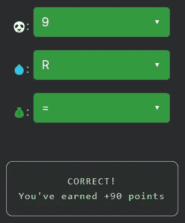

# 天才之路:聪明 18 号

> 原文：<https://blog.devgenius.io/road-to-genius-smart-18-b7142576c850?source=collection_archive---------26----------------------->

每天我都要解决几个 Codr 分级模式的编码挑战和难题。目标是达到天才的等级，在这个过程中我解释了我是如何解决这些问题的。你不需要任何编程背景就可以开始，而且你会学到很多新的有趣的东西。

在这个挑战中，我们需要修复三个错误🐼,💧和💰。第一个🐼出现在第一行，它必须是数组`arr`的数值。不先分析代码是无法算出它的值的，那就继续吧。

我们注意到代码中有一个 while 循环，只要数组不为空，它就会迭代(并使用 pop 提取值)。结果，if 条件表明变量`R`用于跟踪最大值💧极有可能是`R`。经过仔细检查，变量`prev`没有任何用处，它几乎是死代码。病菌💰必须是`=`，因为线`prev = x`跟踪“先前”值。

有了这些信息，我们很容易找到🐼:挑战代码的目的是找到数组中的最大值。挑战声明`R = 9`，因为 9 已经在数组中，🐼可以是任何数值(包括 9)。

在[https://nevolin.be/codr/](https://nevolin.be/codr/)加入我的天才之路，提升你的编程技能