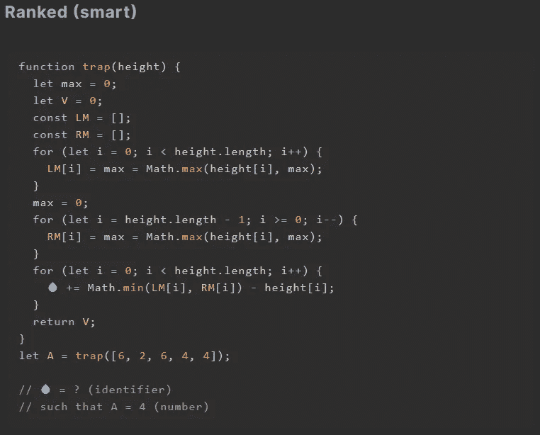
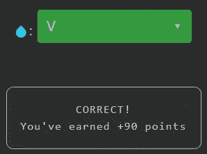
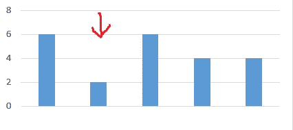

# 天才之路:聪明 19

> 原文：<https://blog.devgenius.io/road-to-genius-smart-19-c682718f1593?source=collection_archive---------46----------------------->

每天我都要解决几个 Codr 分级模式的编码挑战和难题。目标是达到天才的等级，在这个过程中我解释了我是如何解决这些问题的。你不需要任何编程背景就可以开始，而且你会学到很多新的有趣的东西。

这是一个新的挑战，有相当多的代码，但只有一个 bug 需要修复💧。你可以用几种方法解决这个问题，最快的方法是跟踪变量，只有几个潜在的变量适合这个 bug💧。两个`LM and RM`都已经被使用，并且💧不太可能是这些，因为这些是数组，而且💧不是以类似数组的方式使用的。变量`max`似乎跟踪最大值，所以💧不太可能是`max`，因为`max`在那个阶段不再相关。

唯一剩下的没有使用的变量是`V`，它也是函数返回的值，因为`A = 4`，所以`V`不能为零；💧极有可能是`V`。

您可以花几分钟时间更仔细地分析代码，了解发生了什么。简而言之，它计算给定数组中陷阱高度的总和。此代码中的陷阱由被两个更大的值(其自身的左侧和右侧)包围的值来标识，如下图中的箭头所示。用伪代码:`TRAPi = min(left, right) - height`。在这种情况下，只有一个陷阱，所以`A = 4`，它是这样计算的:`A= V= min(6, 6) - 2`

在[https://nevolin.be/codr/](https://nevolin.be/codr/)加入我的天才之路，提升你的编程技能