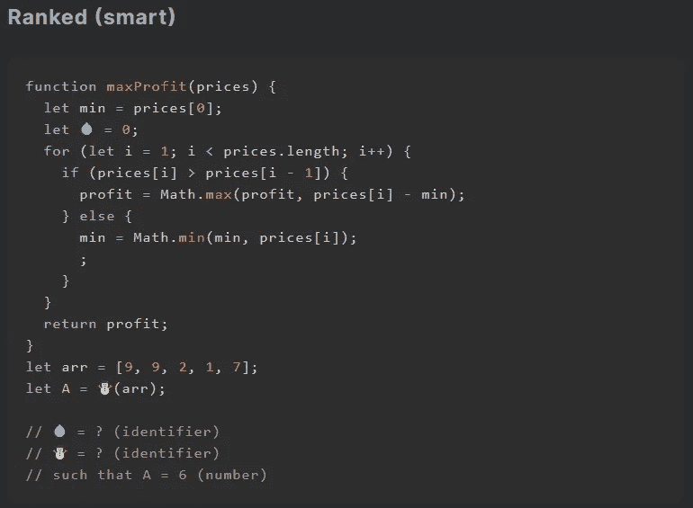
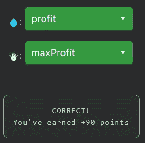

# 天才之路:聪明 20

> 原文：<https://blog.devgenius.io/road-to-genius-smart-20-dc196922083b?source=collection_archive---------45----------------------->

每天我都要解决几个 Codr 分级模式的编码挑战和难题。目标是达到天才的等级，在这个过程中我解释了我是如何解决这些问题的。你不需要任何编程背景就可以开始，而且你会学到很多新的有趣的东西。

尽管这个挑战包含了相当多的代码，但它很容易解决。我们只需要修复错误💧和☃️，所以我们甚至不需要完全分析&理解代码来完成它。

第一个 bug💧很容易，因为这只是变量的初始声明，你可以快速浏览代码，你会发现`profit`是唯一没有声明的变量，所以肯定是它。

最后一个 bug ☃️看起来是一个函数调用，因为它提供了一个参数`arr`，这里唯一的函数是`maxProfit`。

现在我们已经解决了这个问题，让我们花点时间来分析一下代码在做什么。它以数组`arr`开始，然后调用`maxProfit(arr)`。如果仔细观察 for 循环，它从索引 1(而不是 0)开始，然后 If 语句检查数组中的前一个值是否小于当前值；如果是那么:`profit = MathMax(profit, price - min)`。如果不是那么`min = MathMin(min, price)`。简而言之，它通过一些我们不知道(但可以分析)的特定需求来计算利润。

在[https://nevolin.be/codr/](https://nevolin.be/codr/)加入我的天才之路，提升你的编程技能