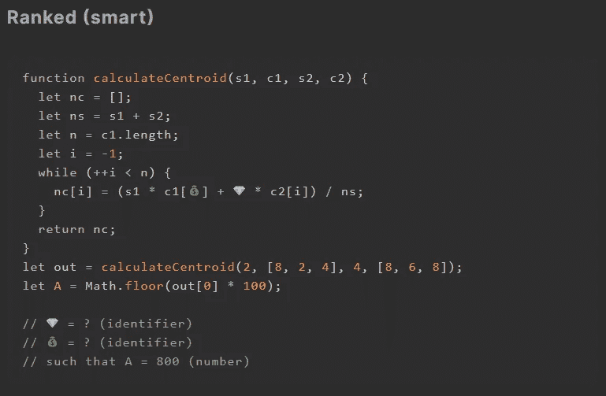
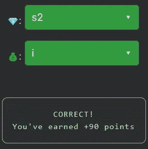

# 天才之路:聪明 21 号

> 原文：<https://blog.devgenius.io/road-to-genius-smart-21-23d8086da2be?source=collection_archive---------37----------------------->

每天我都要解决几个 Codr 分级模式的编码挑战和难题。目标是达到天才的等级，在这个过程中我解释了我是如何解决这些问题的。你不需要任何编程背景就可以开始，而且你会学到很多新的有趣的东西。

这里有一个有趣的挑战，这次和几何有关，但是不要害怕。我们只需要修复两个错误💎和💰。代码从一个带四个参数的函数`calculateCentroid`开始。两个 bug 出现在同一条线上:
`nc[i] = (s1 * c1[💰] + 💎 * c2[i]) / ns;`
你可能知道，对称性是数学中一个非常重要的特性，很多公式，尤其是几何中的公式都具有对称性质。如果您分析这一行错误的代码，您会开始注意到一种模式(或对称)，变量名是一个很好的提示。最有可能的是:
`nc[i] = (s1 * c1[i] + s2 * c2[i]) / ns;`

在[https://nevolin.be/codr/](https://nevolin.be/codr/)加入我的天才之路，提升你的编程技能