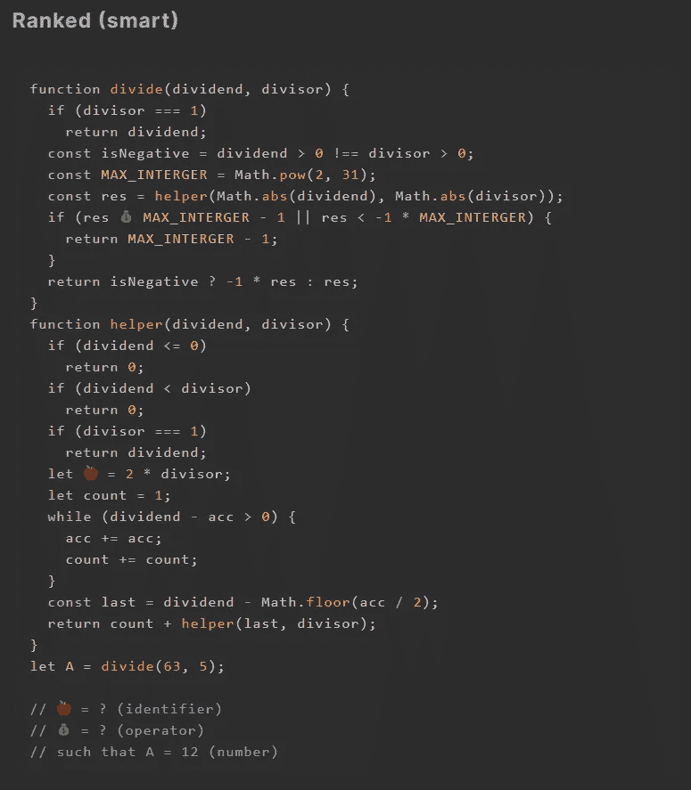
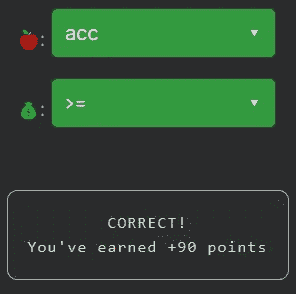

# 天才之路:聪明#22

> 原文：<https://blog.devgenius.io/road-to-genius-smart-22-bf5274f4f177?source=collection_archive---------34----------------------->

每天我都要解决几个 Codr 分级模式的编码挑战和难题。目标是达到天才的等级，在这个过程中我解释了我是如何解决这些问题的。你不需要任何编程背景就可以开始，而且你会学到很多新的有趣的东西。

我解决了两个不值得一提的超级简单的挑战，但是这个挑战改变了游戏规则。相当多的代码，但是正如你现在可能知道的，每当我们必须修复错误时，没有必要为了完成挑战而完全理解代码。

我们需要修复这些错误💰和🍎，不要被复杂的代码量吓到，比看起来简单。第一个 bug 需要一个操作符，这行代码是:
`if (res 💰 MAX_INTERGER - 1 || res < -1 * MAX_INTERGER)`
幸运的是，这一行代码中使用的变量名揭示了代码的本质。首先，变量`res`通常是 result、response 或本例中的 residue(又名 remainder)的简写。如果我们简化上面的代码，它实际上做了以下事情:
`if (remainder 💰 VERY_LARGE or remainder < VERY_SMALL)`
因为第二个操作符是`<`，第一个很可能是`>`或`>=`，其中一个在数学上更正确，但这已经超出了本文的范围。

第二个 bug🍎是一个变量的声明，要修复它我们需要找到一些以前没有声明过的变量，那就是`acc`(累加器)。

通过解决这些挑战，你可以训练自己成为一名更好的程序员。您将学到更新更好的分析、调试和改进代码的方法。因此，你在商业上会更有效率和价值。在[https://nevolin.be/codr/](https://nevolin.be/codr/)加入我的天才之路，提升你的编程技能