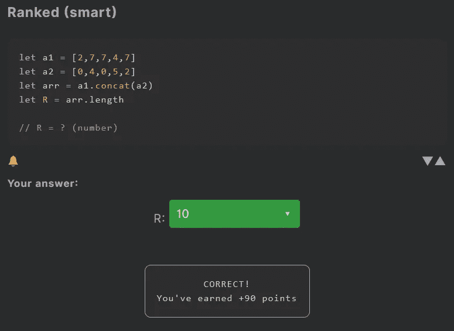
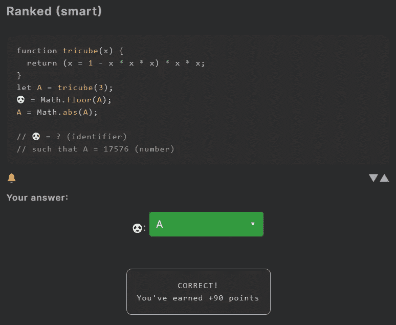

# 天才之路:聪明#23

> 原文：<https://blog.devgenius.io/road-to-genius-smart-23-968550f77abd?source=collection_archive---------37----------------------->

每天我都要解决几个 Codr 分级模式的编码挑战和难题。目标是达到天才的等级，在这个过程中我解释了我是如何解决这些问题的。你不需要任何编程背景就可以开始，而且你会学到很多新的有趣的东西。

在这篇文章中，我将讨论两个挑战。两者都很简单，但值得分析，尤其是对初学者而言。

第一个挑战从两个数组开始，两个数组都填充了 5 个随机数。然后它创建一个新的数组`arr`，它是`= a1.concat(a2)`。concat 操作获取来自`a1`的值并附加`a2`的值，基本上它合并了两个数组。最终`arr`将包含 10 个数字(首先全部来自`a1`，然后全部来自`a2`)。这就是串联的意思。因此，为了解决这个挑战，我们需要解决`R = arr.length`，也就是 10。

第二个挑战稍微困难一些。这次挑战要求我们修复漏洞🐼。它还指出`A = 17576`是一个相当大的数字，并且`tricube`函数对于初学者来说看起来很吓人。但幸运的是，您可以忽略这些信息。虫子🐼似乎只是一个变量名，在该范围内唯一有意义的变量是`A`。

让我们简单讨论一下最后三行代码。这创建了变量 A，并赋予它从函数返回的值。
`A = Math.floor(A);`这将 A 的值向下舍入，例如 0.5 变为 0，5.2 变为 5，7.9 变为 7。这就是地板滚圆的工作原理。
`A = Math.abs(A);`这保证了 A 是绝对的(非负)。

通过解决这些挑战，你可以训练自己成为一名更好的程序员。您将学到更新更好的分析、调试和改进代码的方法。因此，你在商业上会更有效率和价值。在[https://nevolin.be/codr/](https://nevolin.be/codr/)加入我的天才之路，提升你的编程技能