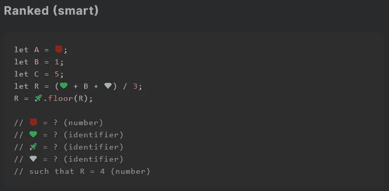
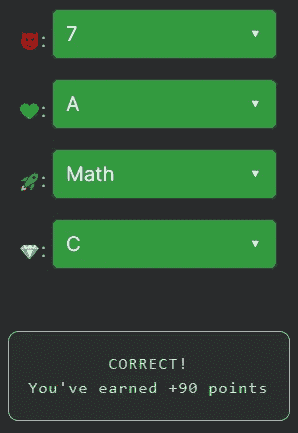

# 天才之路:聪明#24

> 原文：<https://blog.devgenius.io/road-to-genius-smart-24-89b8058d8765?source=collection_archive---------32----------------------->

每天我都要解决几个 Codr 分级模式的编码挑战和难题。目标是达到天才的等级，在这个过程中我解释了我是如何解决这些问题的。你不需要任何编程背景就可以开始，而且你会学到很多新的有趣的东西。

在这个挑战中，我们必须修复四个错误，这是一个简单的挑战，但需要一些关注。

前三行初始化变量`A, B and C`，变量`A`的值未知😈。第 4 行使用下面的等式声明了`R`:
`(💚 + B + 💎) / 3;`
这一行包含了 bug💚和💎，这两个最有可能分别是`A`和`C`(中间的`B`糟蹋了它)。该公式似乎是在计算三个变量的平均值。

最后我们有了 buggy line:
`R = 🚀.floor(R);`
常用函数`floor`揭示🚀必须是 JavaScript 的`Math`对象。

找到我们剩下的 bug😈，我们必须逆向工程`R`，我们知道它应该等于 4(给定)。这也可以写成:
`4 = (A+1+5)/3``A`为未知数😈。改写这个等式后，我们发现。但是 6 不是可供选择的答案，所以我们必须使用另一个值😈。请记住，值`R`在最后一行被舍入，所以基本上😈只要`R = 4`可以是任意值。可接受的答案是 7 和 8，因为:
`(7+1+5)/3 = 4.333`和`(8+1+5)/3 = 4.666`

通过解决这些挑战，你可以训练自己成为一名更好的程序员。您将学到更新更好的分析、调试和改进代码的方法。因此，你在商业上会更有效率和价值。在[https://nevolin.be/codr/](https://nevolin.be/codr/)加入我的天才之路，提升你的编程技能