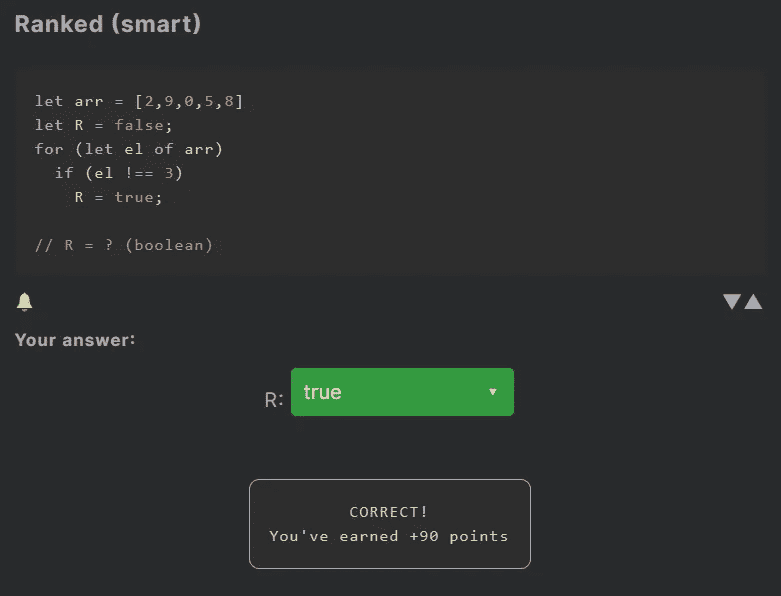
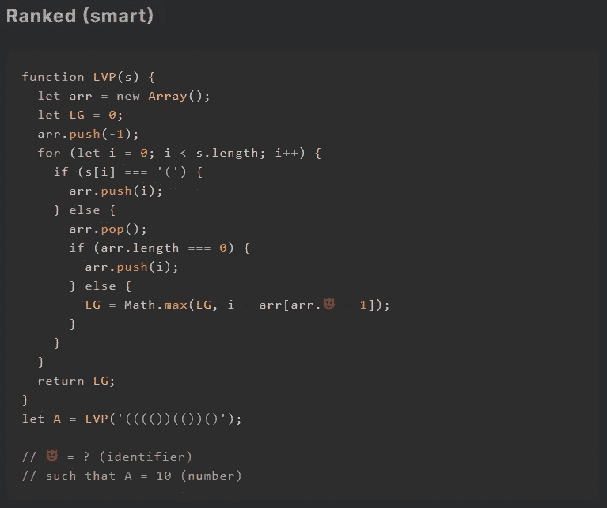
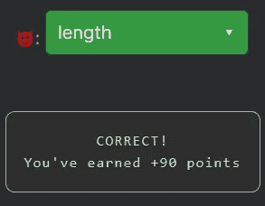

# 天才之路:聪明#25

> 原文：<https://blog.devgenius.io/road-to-genius-smart-25-853245ad2280?source=collection_archive---------34----------------------->

每天我都要解决几个 Codr 分级模式的编码挑战和难题。目标是达到天才的等级，在这个过程中我解释了我是如何解决这些问题的。你不需要任何编程背景就可以开始，而且你会学到很多新的有趣的东西。

在这篇文章中，我将讨论两个挑战，一个简单的和一个更难的。

对于第一个挑战，我们必须找到`R`的值。代码以一组随机数和`R=false`开始。然后 for 循环遍历每个数字。然后，如果该数字不等于 3，则将`R`设置为`true`。答案永远是`true`，除非`arr`中的每个数字都是 3，否则发生这种情况的几率非常小。

第二个挑战的代码要困难得多，但幸运的是我们可以忽略它的大部分，我们只需要修复错误😈。让我们仔细看看 bug 行:
`LG = Math.max(LG, i - arr[arr.😈 - 1]);`
这个好像是一个数组的属性(或者方法)。如果您在 JavaScript 中使用过数组，您可能会立即猜到这一点😈应该是`length`。原因是像`arr.length - 1`这样的代码用于获取数组的最后一个元素(即最后一个索引)。

让我们简要地全面分析一下代码，以理解它的用途。我们有一个接受一个参数的函数，在这种情况下，它接受下面的字符串:
`(((())(())()`
代码遍历所有的括号，不管是左括号还是右括号，它都会跟踪一些东西。最终结果是确定该字符串中最长有效括号的长度，有效意味着它的左括号有一个对应的右括号。
本例中最长的有效括号子字符串是:
`(())(())()`，其长度为 10(这就是为什么`A=10`

通过解决这些挑战，你可以训练自己成为一名更好的程序员。您将学到更新更好的分析、调试和改进代码的方法。因此，你在商业上会更有效率和价值。在[https://nevolin.be/codr/](https://nevolin.be/codr/)加入我的天才之路，提升你的编程技能