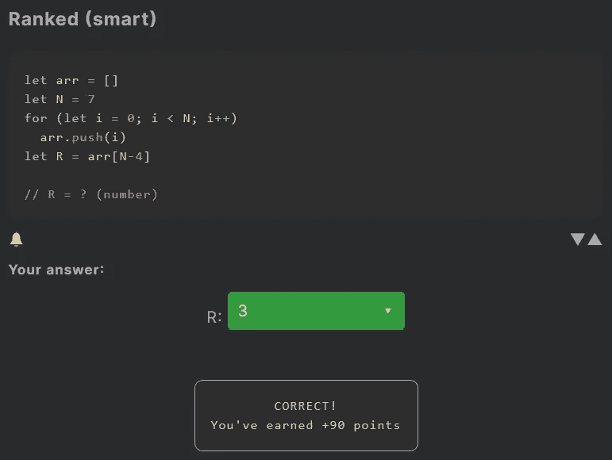
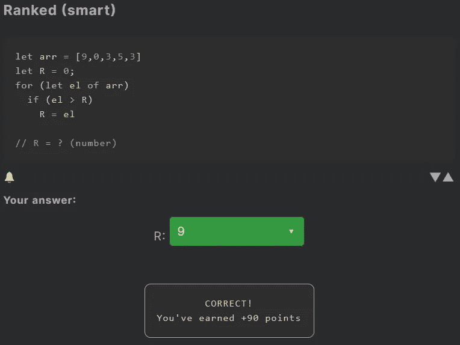

# 天才之路:聪明#26

> 原文：<https://blog.devgenius.io/road-to-genius-smart-26-f37621065e33?source=collection_archive---------55----------------------->

每天我都要解决几个 Codr 分级模式的编码挑战和难题。目标是达到天才的等级，在这个过程中我解释了我是如何解决这些问题的。你不需要任何编程背景就可以开始，而且你会学到很多新的有趣的东西。

今天我们从两个相对简单的挑战开始。我们以前见过这些挑战的类似版本，但这次没有需要修复的错误。

这个挑战从一个空数组开始，然后是一个将数字推入数组的 for 循环。挑战在于确定`R`的值，即`arr[N-4]`。让我们简单分析一下 for 循环:它是从 0 到`N=7`(不包括)向`arr`中加数。所以`arr`最终会包含以下:`0,1,2,3,4,5,6`。
现在`R`是第(N-4)个索引的值，也就是第 3 个索引，也就是 3。

第二个挑战从一组随机数开始。for 循环遍历数组中的每个数字，然后 if 条件检查元素是否大于`R`，如果大于`R`则`R`取其值。简而言之，这段代码跟踪数组中最大的数字。要解决它，只需找到`arr`中最大的数字 9。

通过解决这些挑战，你可以训练自己成为一名更好的程序员。您将学到更新更好的分析、调试和改进代码的方法。因此，你在商业上会更有效率和价值。在[https://nevolin.be/codr/](https://nevolin.be/codr/)加入我的天才之路，提升你的编程技能