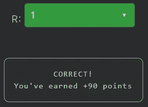

# 天才之路:聪明#27

> 原文：<https://blog.devgenius.io/road-to-genius-smart-27-7aecab1072c?source=collection_archive---------40----------------------->

每天我都要解决几个 Codr 分级模式的编码挑战和难题。目标是达到天才的等级，在这个过程中我解释了我是如何解决这些问题的。你不需要任何编程背景就可以开始，而且你会学到很多新的有趣的东西。


这是一个有趣的挑战，它很短，但有一些有趣的性质。之前很多集我们都遇到过类似的代码，但这次我们要全面分析。

它以一个空对象`MP`和一个字符串`T`开始。for 循环遍历`T`中的每个字符，if 条件检查该字符在`MP`对象中是否有 key-entry。如果没有，它会添加值为 0 的键。然后，它将该键的值递增 1。
在最后`R = MP[T[4]]`
这最后一行通过 key 从`MP`得到值，也就是`T`的第 4 个索引。这是一口。

这段代码所做的就是统计`T`的字符出现的次数。由于`T`中的所有字符都是唯一的，`MP`的值都等于 1。在内部`MP`会是这样的:

```
MP = {
  'j': 1,
  'p': 1,
  'n': 1,
  't': 1,
  'm': 1,
  'u': 1
}
```

我们再仔细看看最后一行:
`R = MP[T[4]]`
我们要先从最深的一端解剖:
`T[4]`这从`T`得到索引 4 处的字符，也就是`m`。
现在我们可以代入:`R = MP['m']`
我们已经知道`MP`的值是什么，所以`R`会是 1。



通过解决这些挑战，你可以训练自己成为一名更好的程序员。您将学到更新更好的分析、调试和改进代码的方法。因此，你在商业上会更有效率和价值。在[https://nevolin.be/codr/](https://nevolin.be/codr/)加入我的天才之路，提升你的编程技能