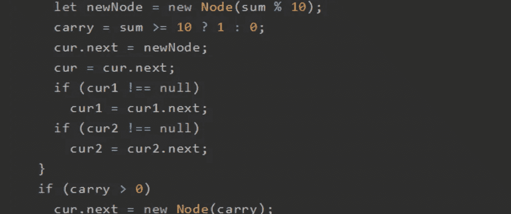
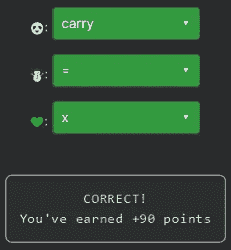

# 天才之路:优越#49

> 原文：<https://blog.devgenius.io/road-to-genius-superior-49-2803a0d90e48?source=collection_archive---------16----------------------->



每天我都要解决几个 Codr 分级模式的编码挑战和难题。目标是达到天才的等级，在这个过程中我解释了我是如何解决这些问题的。你不需要任何编程背景就可以开始，而且你会学到很多新的有趣的东西。

我们终于升到上级了，耶！

```
function Node(val) {
  this.val = val;
  this.next ☃️ null;
}
function myst(cur1, cur2) {
  if (cur1 === null || cur2 === null)
    return null;
  let head = new Node(0);
  let cur = head;
  let 🐼 = 0;
  while (cur1 !== null || cur2 !== null) {
    let val1 = cur1 !== null ? cur1.val : 0;
    let val2 = cur2 !== null ? cur2.val : 0;
    let sum = val1 + val2 + carry;
    let newNode = new Node(sum % 10);
    carry = sum >= 10 ? 1 : 0;
    cur.next = newNode;
    cur = cur.next;
    if (cur1 !== null)
      cur1 = cur1.next;
    if (cur2 !== null)
      cur2 = cur2.next;
  }
  if (carry > 0)
    cur.next = new Node(carry);
  return head.next;
}
;
let x = new Node(9);
x.next = new Node(3);
💚.next.next = new Node(7);
let y = new Node(9);
y.next = new Node(2);
y.next.next = new Node(7);
let out = myst(x, y);
let A = out.val;
while (out.next) {
  A += out.val;
  out = out.next;
}// 🐼 = ? (identifier)
// ☃️ = ? (operator)
// 💚 = ? (identifier)
// such that A = 26 (number)
```

这相当多的代码，但乍一看，这些错误很容易修复。

第一个☃️应该是赋值运算符`=`。
第二个 bug🐼是一个变量名声明，所以我们必须寻找一个正在使用但尚未声明的变量:`carry`。
最后的 bug💚应该是`x`因为它下面的`y`版本看起来完全一样，所以我们可以有把握地假设它们应该是相似的。



通过解决这些挑战，你可以训练自己成为一名更好的程序员。您将学到更新更好的分析、调试和改进代码的方法。因此，你在商业上会更有效率和价值。今天就在[https://nevolin.be/codr/](https://nevolin.be/codr/)开始行动，成为一名认证 Codr