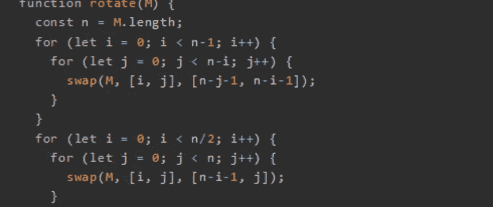
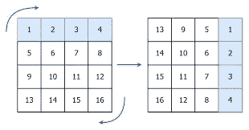
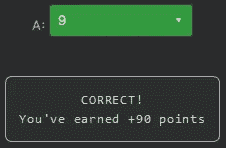

# 天才之路:优越#50

> 原文：<https://blog.devgenius.io/road-to-genius-superior-50-ac2f61f09eaa?source=collection_archive---------11----------------------->



每天我都要解决几个 Codr 分级模式的编码挑战和难题。目标是达到天才的等级，在这个过程中我解释了我是如何解决这些问题的。你不需要任何编程背景就可以开始，而且你会学到很多新的有趣的东西。

```
function swap(arr, [i, j], [m, n]) {
  const temp = arr[i][j];
  arr[i][j] = arr[m][n];
  arr[m][n] = temp;
}function rotate(M) {
  const n = M.length;
  for (let i = 0; i < n-1; i++) {
    for (let j = 0; j < n-i; j++) {
      swap(M, [i, j], [n-j-1, n-i-1]);
    }
  }
  for (let i = 0; i < n/2; i++) {
    for (let j = 0; j < n; j++) {
      swap(M, [i, j], [n-i-1, j]);
    }
  }
}let M = [
  [7,4,7],
  [9,6,4],
  [1,3,9]
]
rotate(M);
let A = M[2][0]// A = ? (number)
```

在今天的挑战中，我们将摆弄 2D 矩阵。没有需要修复的错误，只需要一个答案。

快速浏览代码后，函数`rotate`揭示了它的本质，它将输入矩阵旋转了 90 °,如下所示:



如果你不相信我，你可以拿一张纸算出来，用伪代码旋转如下:

```
| 7 4 7 |              | 1 9 7 |
| 9 6 4 |  -- 90° -->  | 3 6 4 |
| 1 3 9 |              | 9 4 7 |
```

注意，`i`是行，`j`是列。
要找到`A`的值，我们需要从第 2 行第 0 列得到数字，即 9(左下角)。



通过解决这些挑战，你可以训练自己成为一名更好的程序员。您将学到更新更好的分析、调试和改进代码的方法。因此，你在商业上会更有效率和价值。今天就在[https://nevolin.be/codr/](https://nevolin.be/codr/)开始行动并成为认证 Codr