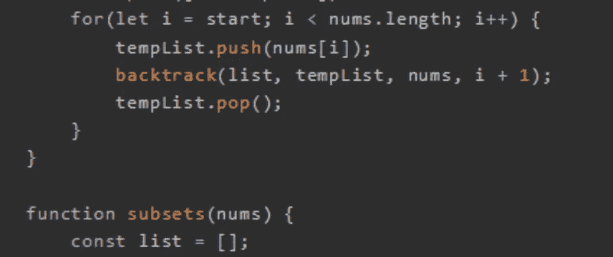
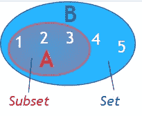
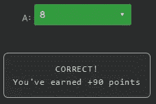

# 天才之路:优越#51

> 原文：<https://blog.devgenius.io/road-to-genius-superior-51-4ffddae38127?source=collection_archive---------18----------------------->



每天我都要解决几个 Codr 分级模式的编码挑战和难题。目标是达到天才的等级，在这个过程中我解释了我是如何解决这些问题的。你不需要任何编程背景就可以开始，而且你会学到很多新的有趣的东西。

```
function backtrack(list, tempList, nums, start) {
    list.push([...tempList]);
    for(let i = start; i < nums.length; i++) {
        tempList.push(nums[i]);
        backtrack(list, tempList, nums, i + 1);
        tempList.pop();
    }
}function subsets(nums) {
    const list = [];
    backtrack(list, [], nums, 0);
    return list;
}let A = subsets([1, 2, 1]);
A = A.length// A = ? (number)
```

在今天的挑战中，我们必须处理递归回溯。调用函数`subsets`揭示了代码的本质，它将从给定的输入中创建不同子集的列表。在这种情况下，子集类似于唯一组合，只是它们不需要唯一。



```
For input: [1, 2, 1]
We expect the following subsets:
1
1 2
1 2 1
1 1
2
2 1
1
```

可能有 8 个子集，因此答案应该是这样的:



如果你在纸上算出这个问题，你会找到这些精确的子集。

通过解决这些挑战，你可以训练自己成为一名更好的程序员。您将学到更新更好的分析、调试和改进代码的方法。因此，你在商业上会更有效率和价值。今天就在[https://nevolin.be/codr/](https://nevolin.be/codr/)开始行动并成为认证 Codr