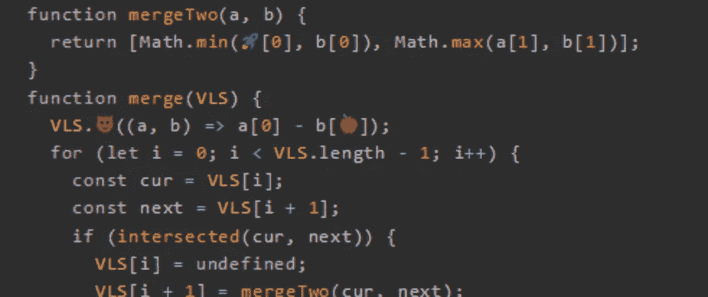
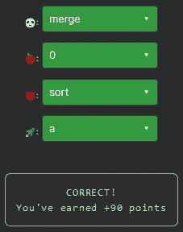

# 天才之路:优越#52

> 原文：<https://blog.devgenius.io/road-to-genius-superior-52-a00c99e364a8?source=collection_archive---------17----------------------->



每天我都要解决几个 Codr 分级模式的编码挑战和难题。目标是达到天才的等级，在这个过程中我解释了我是如何解决这些问题的。你不需要任何编程背景就可以开始，而且你会学到很多新的有趣的东西。

```
function intersected(a, b) {
  if (a[0] > b[1] || a[1] < b[0])
    return false;
  return true;
}
function mergeTwo(a, b) {
  return [Math.min(🚀[0], b[0]), Math.max(a[1], b[1])];
}
function merge(VLS) {
  VLS.😈((a, b) => a[0] - b[🍎]);
  for (let i = 0; i < VLS.length - 1; i++) {
    const cur = VLS[i];
    const next = VLS[i + 1];
    if (intersected(cur, next)) {
      VLS[i] = undefined;
      VLS[i + 1] = mergeTwo(cur, next);
    }
  }
  return VLS.filter(q => q);
}
let arr = [[1, 10], [10, 15], [15, 15]];
let A = 🐼(arr);
A = A[0][1];// 🐼 = ? (identifier)
// 🍎 = ? (number)
// 😈 = ? (identifier)
// 🚀 = ? (identifier)
// such that A = 15 (number)
```

今天的挑战似乎是一些与合并数组相关的特定算法。为了解决这个挑战，我们必须修复四个 bug。

最容易的错误是🐼这应该是对函数`merge`的调用。

下一个 bug🍎很可能是 0，因为箭头函数似乎在比较`a[0]`和`b[0]`。因此🍎很可能会是`sort`功能。类似地，臭虫🚀应该是`a`。

经过简要分析，设计了这种算法来合并给定的区间。注意，输入`arr`是一个[start，end]形式的区间数组。当两个间隔重叠时(使用`intersected`功能)，两个间隔合并成一个。



通过解决这些挑战，你可以训练自己成为一名更好的程序员。您将学到更新更好的分析、调试和改进代码的方法。因此，你在商业上会更有效率和价值。今天就在[https://nevolin.be/codr/](https://nevolin.be/codr/)开始行动，成为一名认证 Codr