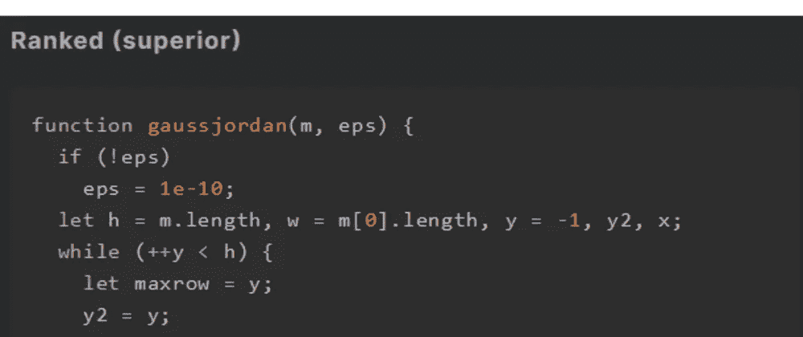
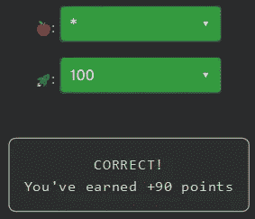

# 天才之路:优越#53

> 原文：<https://blog.devgenius.io/road-to-genius-superior-53-e62c457a51ac?source=collection_archive---------7----------------------->



每天我都要解决几个 Codr 分级模式的编码挑战和难题。目标是达到天才的等级，在这个过程中我解释了我是如何解决这些问题的。你不需要任何编程背景就可以开始，而且你会学到很多新的有趣的东西。

```
function gaussjordan(m, eps) {
  if (!eps)
    eps = 1e-10;
  let h = m.length, w = m[0].length, y = -1, y2, x;
  while (++y < h) {
    let maxrow = y;
    y2 = y;
    while (++y2 < h) {
      if (Math.abs(m[y2][y]) > Math.abs(m[maxrow][y]))
        maxrow = y2;
    }
    let tmp = m[y];
    m[y] = m[maxrow];
    m[maxrow] = tmp;
    if (Math.abs(m[y][y]) <= eps)
      return false;
    y2 = y;
    while (++y2 < h) {
      let c = m[y2][y] / m[y][y];
      x = y - 1;
      while (++x < w) {
        m[y2][x] -= m[y][x] * c;
      }
    }
  }
  y = h;
  while (--y >= 0) {
    let c = m[y][y];
    y2 = -1;
    while (++y2 < y) {
      x = w;
      while (--x >= y) {
        m[y2][x] -= m[y][x] 🍎 m[y2][y] / c;
      }
    }
    m[y][y] /= c;
    x = h - 1;
    while (++x < w) {
      m[y][x] /= c;
    }
  }
  return true;
}
let a2d = [[10, 11, 20], [🚀, 10, 14]];
gaussjordan(a2d);
let A = a2d[0][1];
A = Math.floor(A * 100);
A = Math.abs(A);// 🍎 = ? (operator)
// 🚀 = ? (number)
// such that A = 0 (number)
```

在今天的挑战中，我们将看到一个高斯消去算法。如果你没听说过这个，这是一个解线性方程组的代数方法。你可以在维基百科上读到这些([https://en.wikipedia.org/wiki/Gaussian_elimination](https://en.wikipedia.org/wiki/Gaussian_elimination))。

该函数的输入为:

```
a2d = [[10, 11, 20], [🚀, 10, 14]];which is equivalent to the algebraic notation:
10x + 11y = 20
🚀x + 10y = 14
```

然而，我们只对解决这一复杂的挑战感兴趣。幸运的是，我们只需要关注两个错误。

让我们从第一个 bug 开始🍎，应该是某个运算符。除非您精通数学，否则很难知道这里应该使用哪个运算符:

```
m[y2][x] -= m[y][x] 🍎 m[y2][y] / c;
```

高斯方法依赖于三种主要的行运算来求解任何方程:

```
1\.   Swap the positions of two rows.
2\.   Multiply a row by a non-zero scalar.
3\.   Add to one row a scalar multiple of another.
```

上面的行不是交换两行，也不是将一行乘以一个标量，而是第三行；它是将某一行的标量倍数与另一行相加(或相减)。用代数术语来说，它可以写成:

```
Row_y2 - Row_y 🍎 Row_y2 / c  -->  Row_y2
```

从代码来看，在我看来，变量`c`是两行共享的某种公共因子，在某种程度上允许这段代码导致其中一列(x 或 y)的零值，换句话说，它消除了一个变量来确定其他变量。所以很有可能🍎马上就要`*`了。

最后，发现🚀是非常棘手的，对于这种复杂的代码来说，手动操作是一种过度的杀戮。让我们复制到目前为止的代码并执行它。我们用`*`来表示🍎让我们选择一些随机的小整数🚀，我们将记录`a2d`的输出:

```
🚀  = 10
a2d = [[ 1, 0, -4.6 ], [ 0, 1, 6 ]]🚀  = 5
a2d = [[ 1, 0, 1.022221 ], [ 0, 1, 0.88888 ]]...
```

请注意，第一个等式的 x=1，y=0，而第二个等式的 x=0，y=1。该算法消除了所有与它们在数组中的位置相关的方程。

这个挑战只对`A = a2d[0][1]`感兴趣，它似乎对任何值都是零🚀，所以我们可以选择任意的随机整数🚀。



通过解决这些挑战，你可以训练自己成为一名更好的程序员。您将学到更新更好的分析、调试和改进代码的方法。因此，你在商业上会更有效率和价值。今天就在[https://nevolin.be/codr/](https://nevolin.be/codr/)开始行动，成为一名认证 Codr