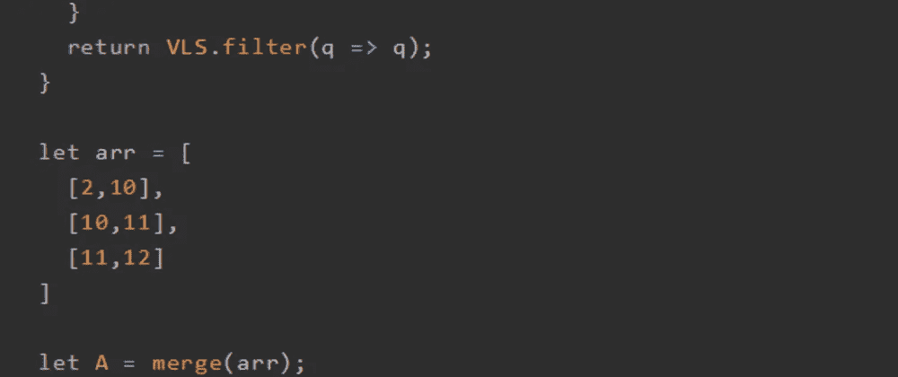
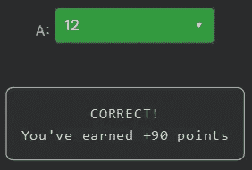

# 天才之路:优越#54

> 原文：<https://blog.devgenius.io/road-to-genius-superior-54-a84b1c23a653?source=collection_archive---------21----------------------->



每天我都要解决几个 Codr 分级模式的编码挑战和难题。目标是达到天才的等级，在这个过程中我解释了我是如何解决这些问题的。你不需要任何编程背景就可以开始，而且你会学到很多新的有趣的东西。

```
function intersected(a, b) {
  if (a[0] > b[1] || a[1] < b[0]) return false;
  return true;
}function mergeTwo(a, b) {
  return [Math.min(a[0], b[0]), Math.max(a[1], b[1])];
}function merge(VLS) {
  VLS.sort((a, b) => a[0] - b[0]);
  for (let i = 0; i < VLS.length - 1; i++) {
    const cur = VLS[i];
    const next = VLS[i + 1];
    if (intersected(cur, next)) {
      VLS[i] = undefined;
      VLS[i + 1] = mergeTwo(cur, next);
    }
  }
  return VLS.filter(q => q);
}let arr = [
  [2,10],
  [10,11],
  [11,12]
]let A = merge(arr);
A = A[0][1]// A = ? (number)
```

我们在几集前就遇到了这个挑战([https://dev.to/codr/road-to-genius-superior-52-4b5m](https://dev.to/codr/road-to-genius-superior-52-4b5m))，这一次我们必须解决它，而不仅仅是修复一些 bug。

从上一篇文章中我们了解到，这段代码的设计目的是根据输入数组是否重叠/相交来合并它们。在伪代码中是这样解释的:

```
x = [1, 5]
y = [5, 9]
--> [1, 9] //they overlap so we can mergex = [1, 5]
y = [6, 9]
--> they do not overlap so cannot merge
```

在上面的代码中，我们有以下内容:

```
let arr = [
  [2,10],
  [10,11],
  [11,12]
]* the first two arrays overlap
* the last two arrays overlap
--> all 3 arrays can be merged into:
[2, 12]
```

挑战要求我们解决`A[0][1]`也就是 12。



通过解决这些挑战，你可以训练自己成为一名更好的程序员。您将学到更新更好的分析、调试和改进代码的方法。因此，你在商业上会更有效率和价值。从今天开始在[https://nevolin.be/codr/](https://nevolin.be/codr/)成为一名认证的 Codr