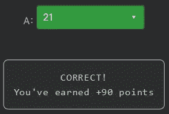

# 天才之路:优越#55

> 原文：<https://blog.devgenius.io/road-to-genius-superior-55-8abdd48d220f?source=collection_archive---------20----------------------->


每天我都要解决几个 Codr 分级模式的编码挑战和难题。目标是达到天才的等级，在这个过程中我解释了我是如何解决这些问题的。你不需要任何编程背景就可以开始，而且你会学到很多新的有趣的东西。

```
function MinStack() {
    this.stack = []
    this.MS = []
};MinStack.prototype.push = function(x) {
    this.stack.push(x)
    if (this.MS.length == 0 || x <= this.MS[this.MS.length - 1]) {
        this.MS.push(x)
    }
};MinStack.prototype.pop = function() {
    const x = this.stack.pop()
    if (x !== void 0 && x === this.MS[this.MS.length - 1]) {
        this.MS.pop()
    }
};MinStack.prototype.top = function() {
    return this.stack[this.stack.length - 1]
};MinStack.prototype.min = function() {
    return this.MS[this.MS.length - 1]
};var obj = new MinStack()
obj.push(20)
obj.push(15)
obj.push(16)
obj.push(3)
obj.push(18)let A = obj.top() + obj.min();// A = ? (number)
```

在今天的挑战中，我们将看到一种叫做`MinStack`的特殊“堆栈”类。

最后几行代码是我们需要分析的:首先，代码将一串数字推送到堆栈中，最后，它会询问答案:

```
obj = MinStack()
obj.push(...)
A = obj.top() + obj.min()
// A = ?
```

`MinStack`的构造函数创建了两个空数组`MS`和`stack`，这就是全部内容。push 函数将参数添加到`stack`数组中，如果数字满足 if 条件，它也将被添加到`MS`。这个特定条件检查`MS`是否为空，或者`MS`中的最新元素是否大于或等于数字。简而言之，如果这个数字比里面的最新数字小(当然，如果它是空的),那么这个数字就会加到`MS`上。因此得名`MinStack`，它记录堆栈结构中最小的数字。

这里有一些伪代码可以帮助我们解决这个难题:

```
stack = []
MS    = []push(20)
stack = [20]
MS    = [20]push(15)
stack = [20, 15]
MS    = [20, 15]push(16)
stack = [20, 15, 16]
MS    = [20, 15]push(3)
stack = [20, 15, 16, 3]
MS    = [20, 15, 3]push(18)
stack = [20, 15, 16, 3, 18]
MS    = [20, 15, 3] A = top() + min()
A = 18    + 3
a = 21
```



通过解决这些挑战，你可以训练自己成为一名更好的程序员。您将学到更新更好的分析、调试和改进代码的方法。因此，你在商业上会更有效率和价值。今天就在 https://nevolin.be/codr/[开始行动，成为一名认证 Codr](https://nevolin.be/codr/)